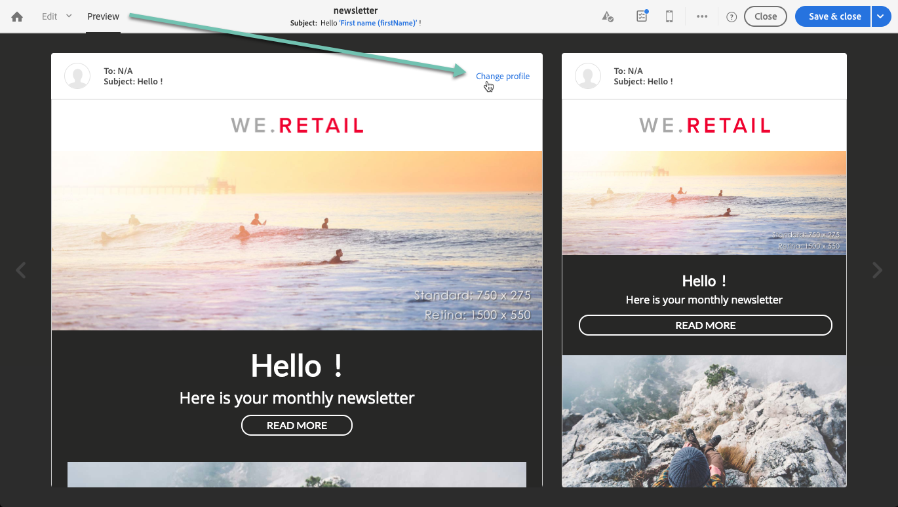

# 使用目標設定檔測試電子郵件訊息 {#testing-message-profiles}

## 概觀 {#overview}

除了[test profiles](../../audiences/using/managing-test-profiles.md)之外，您還可以將自己置於其中一個目標配置檔案的位置來測試電子郵件消息。 這可讓您精確呈現描述檔將收到的訊息（自訂欄位、動態和個人化資訊，包括工作流程的其他資料……）。

>[!NOTE]
>
> 此功能僅適用於電子郵件訊息。

主要步驟如下：

1. 配置您的消息，然後啟動&#x200B;**準備**&#x200B;階段。
1. **在訊息所定位的** 描述檔中選取一或多個描述檔。
1. 將校樣發送到的&#x200B;**替代地址**&#x200B;與每個配置檔案關聯。
1. （可選）針對每個描述檔，定義一個&#x200B;**前置詞**&#x200B;以新增至校對主題行。
1. **預** 覽電子郵件設計人員描述檔的訊息顯示方式。
1. 傳送校樣。

>[!IMPORTANT]
>
>此功能可以讓您將個人資料傳送至外部電子郵件地址。請記住，在Campaign Standard 執行隱私權要求 (GDPR和CCPA) 不會在外部執行該要求。

 [在影片中探索此功能](#video)

## 選擇配置檔案和替代地址{#selecting-profiles}

若要使用目標描述檔進行測試，您必須先選取它們，然後定義接收校樣的替代位址。 To do this, you can either [select specific profiles](#selecting-individual-profiles) among the targeted profiles, or [import profiles from an existing audience](#importing-from-audience).

>[!NOTE]
>
>您最多可以選取100個描述檔進行測試。

### 選擇單個配置檔案{#selecting-individual-profiles}

1. 在消息儀表板中，確保消息準備成功，然後按一下&#x200B;**[!UICONTROL Audience]**&#x200B;塊。

   

1. 在&#x200B;**[!UICONTROL Profile substitutions]**&#x200B;標籤中，按一下&#x200B;**[!UICONTROL Create element]**&#x200B;按鈕以選擇要用於測試的配置檔案。

   

1. 按一下描述檔選擇按鈕，以顯示訊息所定位的描述檔清單。

   

1. 選擇要用於測試的配置檔案，然後在&#x200B;**[!UICONTROL Address]**&#x200B;欄位中輸入所需的替代地址，然後按一下&#x200B;**[!UICONTROL Confirm]**。 所有針對描述檔的校樣都會傳送至此電子郵件地址，而非此描述檔資料庫中定義的校樣。

   如果要在校樣的主旨行中添加特定的前置詞，請填寫&#x200B;**[!UICONTROL Subject line prefix]**&#x200B;欄位。

   >[!NOTE]
   >
   >主旨行首碼最多可包含500個字元。

   

   首碼將顯示如下：

   

1. 配置式將添加到清單中，並帶有其關聯的替代地址和前置詞。 對要用於測試的所有配置檔案重複上述步驟，然後按一下&#x200B;**[!UICONTROL Confirm]**。

   

   如果要向同一個配置檔案的多個替代地址發送證明，必鬚根據需要多次添加此配置檔案。

   在以下示例中，基於配置檔案John Smith的證明將發送到兩個不同的替代地址：

   

1. 定義完所有描述檔和替代地址後，您就可以傳送證明來測試訊息。 若要這麼做，請按一下&#x200B;**[!UICONTROL Test]**&#x200B;按鈕，然後選取要執行的測試類型。

   請注意，如果未將測試配置檔案添加到消息目標中，則&#x200B;**[!UICONTROL Email rendering]**&#x200B;和&#x200B;**[!UICONTROL Proof + Email rendering]**&#x200B;選項不可用。  有關校樣發送的詳細資訊，請參閱[本節](../../sending/using/sending-proofs.md)。

   

>[!IMPORTANT]
>
>如果您對訊息做了任何變更，請務必再次啟動訊息準備。 否則，這些變更將不會反映在證明中。

### 從觀眾{#importing-from-audience}匯入個人檔案

Campaign Standard可讓您匯入可用於測試的設定檔對象。 例如，這可讓您傳送至唯一的電子郵件地址，以不同描述檔為目標的整組訊息。

此外，如果您的觀眾已設定了位址和首碼欄，您就可以在&#x200B;**[!UICONTROL Profile substitutions]**&#x200B;標籤中匯入這些資訊。 [本節](#use-case)中詳細說明了使用替代地址匯入觀眾的範例。

>[!NOTE]
>
>匯入對象時，只會選取與訊息目標對應的描述檔並新增至&#x200B;**[!UICONTROL Profile substitutions]**&#x200B;標籤。

若要匯入設定檔，以便從觀眾進行測試，請遵循下列步驟：

1. 在消息儀表板中，確保消息準備成功，然後按一下&#x200B;**[!UICONTROL Audience]**&#x200B;塊。

   

1. 在 **[!UICONTROL Profile substitutions]** 索引標籤中，按一下 **[!UICONTROL Import from an audience]**。

   

1. 選取要使用的對象，然後輸入要用於傳送給對象的校樣的替代地址和前置詞。

   >[!NOTE]
   >
   >主旨行首碼最多可包含500個字元。

   

   如果要使用的替代地址和／或前置詞已在您的對象中定義，請選擇&#x200B;**[!UICONTROL From Audience]**&#x200B;選項，然後指定用於檢索這些資訊的列。

   

1. 按一下 **[!UICONTROL Import]** 按鈕。來自與消息目標相對應的對象的概要檔案被添加到&#x200B;**[!UICONTROL Profile substitution]**&#x200B;頁籤以及相關的替代地址和前置詞。

>[!NOTE]
>
>如果您再次匯入相同的對象，並使用不同的替代位址和／或前置詞，則除了先前匯入的訪客外，設定檔也會新增至清單。

## 使用目標設定檔預覽訊息

>[!NOTE]
>
>預覽僅適用於電子郵件設計器。

要能夠使用目標配置式預覽消息，請確保已將這些配置式添加到&#x200B;**[!UICONTROL Profile substitution]**&#x200B;清單中（請參閱[定義配置式和替代地址](#selecting-profiles)）。

如果要在消息中使用個性化欄位，則必須在&#x200B;**啟動消息準備之前添加**&#x200B;欄位。 否則，預覽中不會考量這些項目。 因此，如果對個人化欄位進行任何變更，請務必再次啟動訊息準備。

要使用配置檔案替代來預覽消息，請執行以下步驟：

1. 在訊息控制面板中，按一下內容快照，在電子郵件設計工具中開啟訊息。

   

1. 選擇&#x200B;**[!UICONTROL Preview]**&#x200B;頁籤，然後按一下&#x200B;**[!UICONTROL Change profile]**。

   

1. 按一下&#x200B;**[!UICONTROL Profile Substitution]**&#x200B;頁籤以顯示已添加用於測試的替代配置檔案。

   選擇要用於預覽的配置檔案，然後按一下&#x200B;**[!UICONTROL Select]**。

   

1. 會顯示訊息的預覽。 使用箭頭在所選配置檔案之間導航。

   

## 使用案例 {#use-case}

在此使用案例中，我們想傳送個人化電子郵件電子報給一組特定個人檔案。 在傳送電子報之前，我們想使用部分目標設定檔來預覽電子報，並傳送校樣至外部檔案中定義的內部電子郵件地址。

此使用案例的主要步驟如下：

1. 建立要用於測試的觀眾。
1. 建立工作流程，以定位描述檔並傳送電子報。
1. 配置消息的配置檔案替代。
1. 使用目標描述檔預覽訊息。
1. 傳送校樣。

### 步驟1:建立要用於測試的觀眾

1. 準備要匯入的檔案以建立觀眾。 在本例中，它應包含用於證明的替代地址，以及要添加到證明主題行中的前置詞。

   在此範例中，「oliver.vaughan@internal.com」電子郵件地址會收到以「john.doe@mail.com」電子郵件地址為目標之描述檔之訊息的證明。 「JD」首碼將添加到證明的主題行。

   

1. 建立工作流程，從檔案建立觀眾。 若要這麼做，請新增及設定下列活動：

   * **[!UICONTROL Load file]** 活動：匯入CSV檔案(如需此活動的詳細資訊，請參閱 [本節](../../automating/using/load-file.md))。
   * **[!UICONTROL Reconciliation]** 活動：將檔案中的資訊連結到資料庫中的資訊。在此示例中，我們將使用配置檔案的電子郵件地址作為協調欄位（有關此活動的詳細資訊，請參閱[本節](../../automating/using/reconciliation.md)）。
   * **[!UICONTROL Save audience]** 活動：根據匯入的檔案建立對象(如需此活動的詳細資訊，請參 [閱本節](../../automating/using/save-audience.md))。

   

1. 執行工作流程，然後前往&#x200B;**[!UICONTROL Audiences]**&#x200B;標籤，檢查對象是否已使用所需資訊建立。

   在此範例中，觀眾由三個個人檔案組成。 每個證明都會連結至替代電子郵件地址，以接收證明，並在證明的主旨行中使用前置詞。

   

### 步驟2:建立工作流程以鎖定描述檔並傳送電子報

1. 新增&#x200B;**[!UICONTROL Query]**&#x200B;和&#x200B;**[!UICONTROL Email delivery]**&#x200B;活動，然後根據您的需求進行設定（請參閱[Query](../../automating/using/query.md)和[電子郵件傳送](../../automating/using/email-delivery.md)章節）。

   

1. 運行工作流並確保消息準備成功。

### 步驟3:配置消息的「配置檔案替代」頁籤

1. 開啟&#x200B;**[!UICONTROL Email delivery]**&#x200B;活動。 在消息儀表板中，按一下&#x200B;**[!UICONTROL Audience]**&#x200B;塊。

   

1. 選擇&#x200B;**[!UICONTROL Profile substitutions]**&#x200B;頁籤，然後按一下&#x200B;**[!UICONTROL Import from an audience]**。

   

1. 在&#x200B;**[!UICONTROL Audience]**&#x200B;欄位中，選取從檔案建立的對象。

   

1. 定義發送校樣時使用的替代地址和主題行前置詞。

   若要這麼做，請選取&#x200B;**[!UICONTROL From audience]**&#x200B;選項，然後從包含資訊的對象中選取欄。

   

1. 按一下 **[!UICONTROL Import]** 按鈕。來自觀眾的個人檔案會新增至清單，並加上其相關的替代地址和主旨行字首。

   

   >[!NOTE]
   >
   >在本例中，觀眾的所有個人檔案都是以&#x200B;**[!UICONTROL Query]**&#x200B;活動為目標。 如果其中一個描述檔不屬於訊息目標，則不會將其新增至清單。

### 步驟4:使用目標描述檔預覽訊息

1. 在訊息控制面板中，按一下內容快照，在電子郵件設計工具中開啟訊息。

   

1. 選擇&#x200B;**[!UICONTROL Preview]**&#x200B;頁籤，然後按一下&#x200B;**[!UICONTROL Change profile]**。

   

1. 按一下&#x200B;**[!UICONTROL Profile Substitution]**&#x200B;頁籤以顯示以前添加的替代配置檔案。

   選擇要用於預覽的配置檔案，然後按一下&#x200B;**[!UICONTROL Select]**。

   

1. 會顯示訊息的預覽。 使用箭頭在所選配置檔案之間導航。

   

### 步驟5:傳送校樣

1. 在訊息控制面板中，按一下&#x200B;**[!UICONTROL Test]**&#x200B;按鈕，然後確認。

   

1. 校樣會根據&#x200B;**[!UICONTROL Profile substitutions]**&#x200B;標籤中已設定的內容傳送。

   

## 教學課程影片{#video}

此影片顯示如何使用描述檔替代來測試您的電子郵件訊息。

>[!VIDEO](https://video.tv.adobe.com/v/32368?quality=12)

其他Campaign Standard操作說明影片可在[這裡](https://experienceleague.adobe.com/docs/campaign-standard-learn/tutorials/overview.html?lang=zh-Hant)取得。
