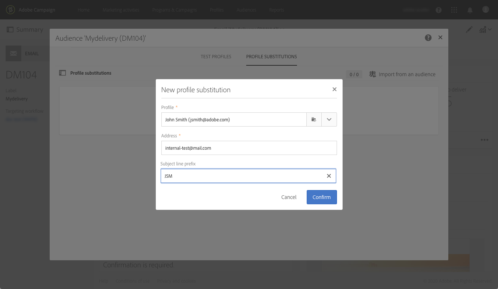

# 使用目標設定檔測試電子郵件訊息 {#testing-message-profiles}

## 概覽 {#overview}

此外 [test配置檔案](../../audiences/using/managing-test-profiles.md)，您可以將自己置於目標配置檔案之一的位置來test電子郵件。 這樣，您就可以獲得配置檔案將接收的消息（自定義欄位、動態和個性化資訊，包括工作流中的其他資料……）的準確表示形式。

>[!IMPORTANT]
>
>此功能可以讓您將個人資料傳送至外部電子郵件地址。請記住，在Campaign Standard 執行隱私權要求 (GDPR和CCPA) 不會在外部執行該要求。

主要步驟如下：

1. 配置您的郵件，然後啟動 **準備** 。
1. **選擇一個或多個配置式** 在消息所針對的配置檔案中。
1. 與每個配置檔案關聯 **替代地址** 將要發送的證據。
1. （可選）對於每個配置檔案，定義 **前置詞** 來添加證據主題行。
1. **預覽** 在電子郵件設計器中，將如何顯示配置檔案的消息。
1. 把證據寄過來。

   >[!IMPORTANT]
   >
   >校樣由 [!DNL Campaign Standard] 標準交貨。 因此，使用配置檔案替換發送校樣將向所選配置檔案的傳遞和跟蹤日誌添加記錄。

 [在影片中探索此功能](#video)

## 選擇配置檔案和替代地址 {#selecting-profiles}

要使用目標配置檔案進行測試，必須首先選擇它們，然後定義接收校樣的替代地址。 為此，您可以 [選擇特定配置檔案](#selecting-individual-profiles) 在目標配置檔案中，或 [從現有受眾導入配置檔案](#importing-from-audience)。

>[!NOTE]
>
>您最多可以選擇100個配置檔案進行測試。

### 選擇單個配置檔案 {#selecting-individual-profiles}

1. 在消息儀表板中，確保消息準備成功，然後按一下 **[!UICONTROL Audience]** 框。

   

1. 在 **[!UICONTROL Profile substitutions]** 頁籤 **[!UICONTROL Create element]** 按鈕，選擇要用於測試的配置檔案。

   

1. 按一下配置檔案選擇按鈕以顯示消息所針對的配置檔案清單。

   

1. 選擇要用於測試的配置檔案，然後在 **[!UICONTROL Address]** 欄位所需的替代地址，然後按一下 **[!UICONTROL Confirm]**。 所有針對配置檔案的校樣都將發送到此電子郵件地址，而不是發送到此配置檔案的資料庫中定義的校樣。

   如果要向校樣的主題行添加特定前置詞，請填寫 **[!UICONTROL Subject line prefix]** 的子菜單。

   >[!NOTE]
   >
   >主題行前置詞最多可包含500個字元。

   

   前置詞顯示如下：

   

1. 配置式將添加到清單中，並包含其關聯的替代地址和前置詞。 對要用於測試的所有配置檔案重複上述步驟，然後按一下 **[!UICONTROL Confirm]**。

   

   如果要向同一配置檔案的多個替代地址發送證明，則必鬚根據需要多次添加此配置檔案。

   在以下示例中，基於配置檔案John Smith的證明將發送到兩個不同的替代地址：

   

1. 定義所有配置檔案和替代地址後，您可以發送證明來test消息。 要執行此操作，請按一下 **[!UICONTROL Test]** 按鈕，選擇要執行的test類型。

   請注意，如果尚未將test配置檔案添加到消息目標， **[!UICONTROL Email rendering]** 和 **[!UICONTROL Proof + Email rendering]** 選項不可用。  有關發送校樣的詳細資訊，請參閱 [此部分](../../sending/using/sending-proofs.md)。

   

>[!IMPORTANT]
>
>如果對郵件進行任何更改，請確保再次啟動郵件準備。 否則，這些變化不會反映在證據中。

### 從受眾導入配置檔案 {#importing-from-audience}

Campaign Standard允許您導入可用於測試的配置檔案的受眾。 例如，這允許您將針對不同配置檔案的整個郵件集發送到唯一的電子郵件地址。

此外，如果您的受眾已配置了地址和前置詞列，則您可以在 **[!UICONTROL Profile substitutions]** 頁籤。 有關使用替代地址導入受眾的示例，請參見 [此部分](#use-case)。

>[!NOTE]
>
>導入受眾時，只選擇與消息目標對應的配置檔案並添加到 **[!UICONTROL Profile substitutions]** 頁籤。

要導入配置檔案以用於從受眾進行測試，請執行以下步驟：

1. 在消息儀表板中，確保消息準備成功，然後按一下 **[!UICONTROL Audience]** 框。

   

1. 在 **[!UICONTROL Profile substitutions]** 索引標籤中，按一下 **[!UICONTROL Import from an audience]**。

   

1. 選擇要使用的受眾，然後輸入要用於發送給受眾的校樣的替代地址和前置詞。

   >[!NOTE]
   >
   >主題行前置詞最多可包含500個字元。

   

   如果要使用的替代地址和/或前置詞已在您的受眾中定義，請選擇 **[!UICONTROL From Audience]** 選項，然後指定用於檢索這些資訊的列。

   

1. 按一下 **[!UICONTROL Import]** 按鈕。將來自與消息目標相對應的受眾的簡檔添加到 **[!UICONTROL Profile substitution]** 頁籤，以及關聯的替代地址和前置詞。

>[!NOTE]
>
>如果您再次導入相同的訪問群體，並且使用不同的替代地址和/或前置詞，則除了上次導入的配置檔案外，配置檔案還將添加到清單中。

## 使用目標配置檔案預覽消息

>[!NOTE]
>
>預覽僅適用於電子郵件設計器。

若要能夠使用目標配置檔案預覽消息，請確保已將這些配置檔案添加到 **[!UICONTROL Profile substitution]** 清單(請參閱 [定義配置檔案和替代地址](#selecting-profiles))。

如果要在消息中使用個性化欄位，則必須添加這些欄位 **先** 啟動消息準備。 否則，預覽中將不考慮這些內容。 因此，如果對個性化設定欄位進行了任何更改，請確保再次啟動消息準備。

要使用配置檔案替換預覽消息，請執行以下步驟：

1. 在消息儀表板中，按一下內容快照以在電子郵件設計器中開啟消息。

   

1. 選擇 **[!UICONTROL Preview]** ，然後按一下 **[!UICONTROL Change profile]**。

   

1. 按一下 **[!UICONTROL Profile Substitution]** 頁籤，顯示已添加用於測試的替代配置檔案。

   選擇要用於預覽的配置式，然後按一下 **[!UICONTROL Select]**。

   

1. 將顯示消息的預覽。 使用箭頭在選定的配置檔案之間導航。

   

## 使用案例 {#use-case}

在此使用案例中，我們希望向一組特定配置檔案發送個性化電子郵件新聞稿。 在發送新聞稿之前，我們希望使用一些目標配置檔案預覽它，並將校樣發送到外部檔案中定義的內部電子郵件地址。

此用例的主要步驟如下：

1. 建立要用於測試的受眾。
1. 構建工作流以確定配置檔案的目標併發送新聞稿。
1. 配置消息的配置檔案替代。
1. 使用目標配置檔案預覽消息。
1. 傳送校樣。

### 步驟1:建立要用於測試的受眾

1. 準備要導入的檔案以建立訪問群體。 在本例中，它應包含用於證明的替代地址，以及添加到證明主題行中的前置詞。

   在本示例中，「oliver.vaughan@internal.com」電子郵件地址將收到以「john.doe@mail.com」電子郵件地址為目標的配置檔案的消息的證明。 「JD」前置詞將添加到證明的主題行。

   

1. 構建工作流以從檔案建立訪問群體。 為此，請添加和配置以下活動：

   * **[!UICONTROL Load file]** 活動：導入CSV檔案(有關本練習的詳細資訊，請參閱 [此部分](../../automating/using/load-file.md))。
   * **[!UICONTROL Reconciliation]** 活動：將檔案中的資訊連結到資料庫中的資訊。 在本示例中，將配置檔案的電子郵件地址用作協調欄位(有關本練習的詳細資訊，請參閱 [此部分](../../automating/using/reconciliation.md))。
   * **[!UICONTROL Save audience]** 活動：根據導入的檔案建立訪問群體(有關本練習的詳細資訊，請參閱 [此部分](../../automating/using/save-audience.md))。

   

1. 運行工作流，然後轉到 **[!UICONTROL Audiences]** 頁籤，檢查是否已使用所需資訊建立了受眾。

   在本例中，觀眾由三個個人資料組成。 每個證書都連結到替代電子郵件地址，該地址將接收證明，並在證明的主題行中使用前置詞。

   

### 步驟2:構建工作流以目標配置檔案併發送新聞稿

1. 添加 **[!UICONTROL Query]** 和 **[!UICONTROL Email delivery]** 活動，然後根據需要配置(請參閱 [查詢](../../automating/using/query.md) 和 [電子郵件傳遞](../../automating/using/email-delivery.md) )的正平方根。

   

1. 運行工作流並確保消息準備成功。

### 第3步：配置消息的「配置檔案」替代頁籤

1. 開啟 **[!UICONTROL Email delivery]** 的子菜單。 在消息儀表板中，按一下 **[!UICONTROL Audience]** 框。

   

1. 選擇 **[!UICONTROL Profile substitutions]** ，然後按一下 **[!UICONTROL Import from an audience]**。

   

1. 在 **[!UICONTROL Audience]**  欄位中，選擇從檔案建立的受眾。

   

1. 定義在發送校樣時使用的替代地址和主題行前置詞。

   要執行此操作，請選擇 **[!UICONTROL From audience]** 選項，然後從包含資訊的受眾中選擇列。

   

1. 按一下 **[!UICONTROL Import]** 按鈕。將來自受眾的配置檔案添加到清單中，並添加其關聯的替代地址和主題行前置詞。

   

   >[!NOTE]
   >
   >在本案中，來自觀眾的所有個人資料都是 **[!UICONTROL Query]** 的子菜單。 如果其中一個配置檔案不是消息目標的一部分，則不會將其添加到清單中。

### 第4步：使用目標配置檔案預覽消息

1. 在消息儀表板中，按一下內容快照以在電子郵件設計器中開啟消息。

   

1. 選擇 **[!UICONTROL Preview]** ，然後按一下 **[!UICONTROL Change profile]**。

   

1. 按一下 **[!UICONTROL Profile Substitution]** 頁籤，顯示以前添加的替代配置檔案。

   選擇要用於預覽的配置式，然後按一下 **[!UICONTROL Select]**。

   

1. 將顯示消息的預覽。 使用箭頭在選定的配置檔案之間導航。

   

### 第5步：發送校樣

1. 在消息儀表板中，按一下 **[!UICONTROL Test]** 按鈕，確認。

   

1. 校樣根據中配置的內容發送 **[!UICONTROL Profile substitutions]** 頁籤。

   

## 教程視頻 {#video}

此視頻顯示如何使用配置檔案替換test電子郵件。

>[!VIDEO](https://video.tv.adobe.com/v/32368?quality=12)

可提供其他Campaign Standard操作視頻 [這裡](https://experienceleague.adobe.com/docs/campaign-standard-learn/tutorials/overview.html?lang=zh-Hant)。
