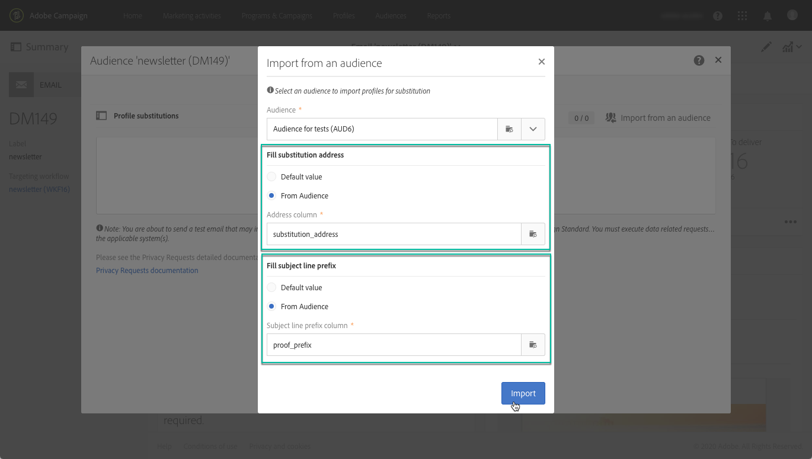

# 使用目標設定檔測試電子郵件訊息 {#testing-message-profiles}

## 概覽 {#overview}

此外，除了[測試設定檔](../../audiences/using/managing-test-profiles.md)之外，您還可以將您自己置於其中一個目標設定檔的位置，以測試電子郵件訊息。 這可讓您取得設定檔將收到之訊息的精確表示（自訂欄位、動態和個人化資訊，包括工作流程的其他資料……）。

>[!IMPORTANT]
>
>此功能可以讓您將個人資料傳送至外部電子郵件地址。請記住，在Campaign Standard 執行隱私權要求 (GDPR和CCPA) 不會在外部執行該要求。

主要步驟如下：

1. 設定您的訊息，然後啟動&#x200B;**準備**&#x200B;階段。
1. **在訊息所定位的設定檔中，選取一或多個設定檔**。
1. 將校樣將傳送到的&#x200B;**替代地址**&#x200B;與每個設定檔建立關聯。
1. （選擇性）對於每個設定檔，定義一個&#x200B;**首碼**&#x200B;以新增到校樣主旨列。
1. 在電子郵件Designer中&#x200B;**預覽**&#x200B;設定檔的訊息顯示方式。
1. 傳送校樣。

   >[!IMPORTANT]
   >
   >校訂由[!DNL Campaign Standard]以標準傳遞方式處理。 因此，使用設定檔替代傳送校樣會將記錄新增到所選設定檔的傳送和追蹤記錄中。

 [在影片中探索此功能](#video)

## 選取設定檔和替代地址 {#selecting-profiles}

若要使用目標設定檔進行測試，您必須先選取設定檔，然後定義將接收校樣的替代地址。 若要這麼做，您可在目標設定檔中[選取特定設定檔](#selecting-individual-profiles)，或是[從現有對象](#importing-from-audience)匯入設定檔。

>[!NOTE]
>
>您最多可以選取100個設定檔進行測試。

### 選取個別設定檔 {#selecting-individual-profiles}

1. 在訊息控制面板中，確定訊息準備成功，然後按一下&#x200B;**[!UICONTROL Audience]**&#x200B;區塊。

   

1. 在&#x200B;**[!UICONTROL Profile substitutions]**&#x200B;索引標籤中，按一下&#x200B;**[!UICONTROL Create element]**&#x200B;按鈕以選取要用於測試的設定檔。

   

1. 按一下設定檔選擇按鈕，以顯示訊息鎖定的設定檔清單。

   

1. 選取要用於測試的設定檔，然後在&#x200B;**[!UICONTROL Address]**&#x200B;欄位中輸入所需的替代地址，然後按一下&#x200B;**[!UICONTROL Confirm]**。 所有以設定檔為目標的校樣都會傳送到此電子郵件地址，而不是傳送到資料庫中為此設定檔定義的電子郵件地址。

   如果您想要在校樣的主旨列新增特定首碼，請填入&#x200B;**[!UICONTROL Subject line prefix]**&#x200B;欄位。

   >[!NOTE]
   >
   >主旨列前置詞最多可包含500個字元。

   

   前置詞顯示如下：

   

1. 設定檔會新增至清單中，並包含其相關的替代地址與首碼。 對您要用於測試的所有設定檔重複上述步驟，然後按一下&#x200B;**[!UICONTROL Confirm]**。

   

   如果您想要針對相同的設定檔將校樣傳送至多個替代地址，則必須視需要多次新增此設定檔。

   在下列範例中，根據設定檔John Smith的校樣將傳送至兩個不同的替代地址：

   

1. 定義所有設定檔和替代地址後，您可以傳送校樣以測試訊息。 若要這麼做，請按一下&#x200B;**[!UICONTROL Test]**&#x200B;按鈕，然後選取要執行的測試型別。

   請注意，如果未將測試設定檔新增至訊息目標，則&#x200B;**[!UICONTROL Email rendering]**&#x200B;和&#x200B;**[!UICONTROL Proof + Email rendering]**&#x200B;選項無法使用。  如需證明傳送的詳細資訊，請參閱[本節](../../sending/using/sending-proofs.md)。

   

>[!IMPORTANT]
>
>如果您對訊息進行變更，請務必再次啟動訊息準備。 否則，變更將不會反映在校樣中。

### 從對象匯入設定檔 {#importing-from-audience}

Campaign Standard可讓您匯入可用於測試的設定檔對象。 舉例來說，這可讓您將目標定位不同設定檔的整組訊息傳送至唯一的電子郵件地址。

此外，如果您的對象已設定位址和前置詞欄，您就可以在&#x200B;**[!UICONTROL Profile substitutions]**&#x200B;索引標籤中匯入這些資訊。 [本節](#use-case)中詳細說明了使用替代地址匯入對象的範例。

>[!NOTE]
>
>匯入對象時，只會選取與訊息目標對應的設定檔，並將其新增至&#x200B;**[!UICONTROL Profile substitutions]**&#x200B;索引標籤。

若要匯入設定檔以用於從對象進行測試，請遵循下列步驟：

1. 在訊息控制面板中，確定訊息準備已成功，然後按一下&#x200B;**[!UICONTROL Audience]**&#x200B;區塊。

   

1. 在 **[!UICONTROL Profile substitutions]** 索引標籤中，按一下 **[!UICONTROL Import from an audience]**。

   

1. 選取要使用的對象，然後輸入用於傳送給對象之校樣的替代地址與首碼。

   >[!NOTE]
   >
   >主旨列前置詞最多可包含500個字元。

   

   如果您的對象中已定義要使用的替代位址和/或首碼，請選取&#x200B;**[!UICONTROL From Audience]**&#x200B;選項，然後指定要用來擷取這些資訊的欄。

   

1. 按一下 **[!UICONTROL Import]** 按鈕。與訊息目標相對應的對象設定檔已新增至&#x200B;**[!UICONTROL Profile substitution]**&#x200B;標籤，以及相關替代位址和首碼。

>[!NOTE]
>
>如果您再次匯入相同的對象，並使用不同的替代地址和/或首碼，則除了上次匯入的對象外，這些設定檔將會新增到清單中。

## 使用目標設定檔預覽訊息

>[!NOTE]
>
>預覽功能僅適用於電子郵件Designer。

若要能夠使用目標設定檔預覽訊息，請確定您已將這些設定檔新增到&#x200B;**[!UICONTROL Profile substitution]**&#x200B;清單（請參閱[定義設定檔和替代地址](#selecting-profiles)）。

如果您想要在訊息中使用個人化欄位，必須在&#x200B;**之前**&#x200B;新增這些欄位，才能啟動訊息準備。 否則，在預覽中不會考慮這些量度。 因此，如果個人化欄位有任何變更，請務必再次啟動訊息準備。

若要使用設定檔替代預覽訊息，請遵循下列步驟：

1. 在訊息控制面板中，按一下內容快照，以在電子郵件Designer中開啟訊息。

   

1. 選取&#x200B;**[!UICONTROL Preview]**&#x200B;標籤，然後按一下&#x200B;**[!UICONTROL Change profile]**。

   

1. 按一下「**[!UICONTROL Profile Substitution]**」標籤，以顯示已新增以供測試的替代設定檔。

   選取您要用於預覽的設定檔，然後按一下&#x200B;**[!UICONTROL Select]**。

   

1. 訊息預覽隨即顯示。 使用箭頭在選取的設定檔之間導覽。

   

## 使用實例 {#use-case}

在此使用案例中，我們想要將個人化電子郵件電子報傳送至一組特定設定檔。 在傳送Newsletter之前，我們想使用一些目標設定檔來預覽它，並將校樣傳送到外部檔案中定義的內部電子郵件地址。

此使用案例的主要步驟如下：

1. 建立要用於測試的對象。
1. 建立工作流程以定位設定檔並傳送Newsletter。
1. 設定訊息的設定檔替代。
1. 使用目標設定檔預覽訊息。
1. 傳送校樣。

### 步驟1：建立對象以用於測試

1. 準備要匯入的檔案以建立對象。 在我們的案例中，它應該包含用於校樣的替代地址，以及要新增到校樣的主旨行中的前置詞。

   在此範例中，「oliver.vaughan@internal.com」電子郵件地址將收到以具有「john.doe@mail.com」電子郵件地址的設定檔為目標的郵件校樣。 「JD」首碼將新增至校樣的主旨行。

   

1. 建置工作流程，從檔案建立對象。 若要這麼做，請在底下新增並設定活動：

   * **[!UICONTROL Load file]**&#x200B;活動：匯入CSV檔案（如需此活動的詳細資訊，請參閱[本區段](../../automating/using/load-file.md)）。
   * **[!UICONTROL Reconciliation]**&#x200B;活動：從檔案連結資訊到資料庫資訊。 在此範例中，使用設定檔的電子郵件地址作為調解欄位（如需此活動的詳細資訊，請參閱[此區段](../../automating/using/reconciliation.md)）。
   * **[!UICONTROL Save audience]**&#x200B;活動：根據匯入的檔案建立對象（如需此活動的詳細資訊，請參閱[本區段](../../automating/using/save-audience.md)）。

   

1. 執行工作流程，然後前往&#x200B;**[!UICONTROL Audiences]**&#x200B;標籤以檢查對象是否已使用所需資訊建立。

   在此範例中，對象是由三個設定檔組成。 其中每個檔案都連結至將接收校樣的替代電子郵件地址，並在校樣的主旨行中使用前置詞。

   

### 步驟2：建立工作流程以定位設定檔並傳送Newsletter

1. 新增&#x200B;**[!UICONTROL Query]**&#x200B;和&#x200B;**[!UICONTROL Email delivery]**&#x200B;活動，然後根據您的需求進行設定（請參閱[查詢](../../automating/using/query.md)和[電子郵件傳遞](../../automating/using/email-delivery.md)區段）。

   

1. 執行工作流程，並確認訊息準備成功。

### 步驟3：設定訊息的「設定檔替代」標籤

1. 開啟&#x200B;**[!UICONTROL Email delivery]**&#x200B;活動。 在訊息控制面板中，按一下&#x200B;**[!UICONTROL Audience]**&#x200B;區塊。

   

1. 選取&#x200B;**[!UICONTROL Profile substitutions]**&#x200B;標籤，然後按一下&#x200B;**[!UICONTROL Import from an audience]**。

   

1. 在&#x200B;**[!UICONTROL Audience]**&#x200B;欄位中，選取從檔案建立的對象。

   

1. 定義傳送校樣時使用的替代地址與主旨行首碼。

   若要這麼做，請選取&#x200B;**[!UICONTROL From audience]**&#x200B;選項，然後從包含資訊的對象中選取欄。

   

1. 按一下 **[!UICONTROL Import]** 按鈕。對象的設定檔會新增至清單，及其相關替代地址和主旨行首碼。

   

   >[!NOTE]
   >
   >在本例中，對象中的所有設定檔皆為&#x200B;**[!UICONTROL Query]**&#x200B;活動所定位。 如果其中一個設定檔不屬於訊息目標，則不會將其新增至清單。

### 步驟4：使用目標設定檔預覽訊息

1. 在訊息控制面板中，按一下內容快照，以在電子郵件Designer中開啟訊息。

   

1. 選取&#x200B;**[!UICONTROL Preview]**&#x200B;標籤，然後按一下&#x200B;**[!UICONTROL Change profile]**。

   

1. 按一下&#x200B;**[!UICONTROL Profile Substitution]**&#x200B;標籤以顯示先前已新增的替代設定檔。

   選取您要用於預覽的設定檔，然後按一下&#x200B;**[!UICONTROL Select]**。

   

1. 訊息預覽隨即顯示。 使用箭頭在選取的設定檔之間導覽。

   

### 步驟5：傳送校樣

1. 在訊息控制面板中，按一下&#x200B;**[!UICONTROL Test]**&#x200B;按鈕，然後確認。

   

1. 根據&#x200B;**[!UICONTROL Profile substitutions]**&#x200B;索引標籤中已設定的專案來傳送校樣。

   

## 教學課程影片 {#video}

本影片說明如何使用設定檔替代來測試您的電子郵件訊息。

>[!VIDEO](https://video.tv.adobe.com/v/32368?quality=12)

[此處](https://experienceleague.adobe.com/docs/campaign-standard-learn/tutorials/overview.html?lang=zh-Hant)提供其他Campaign Standard操作說明影片。
