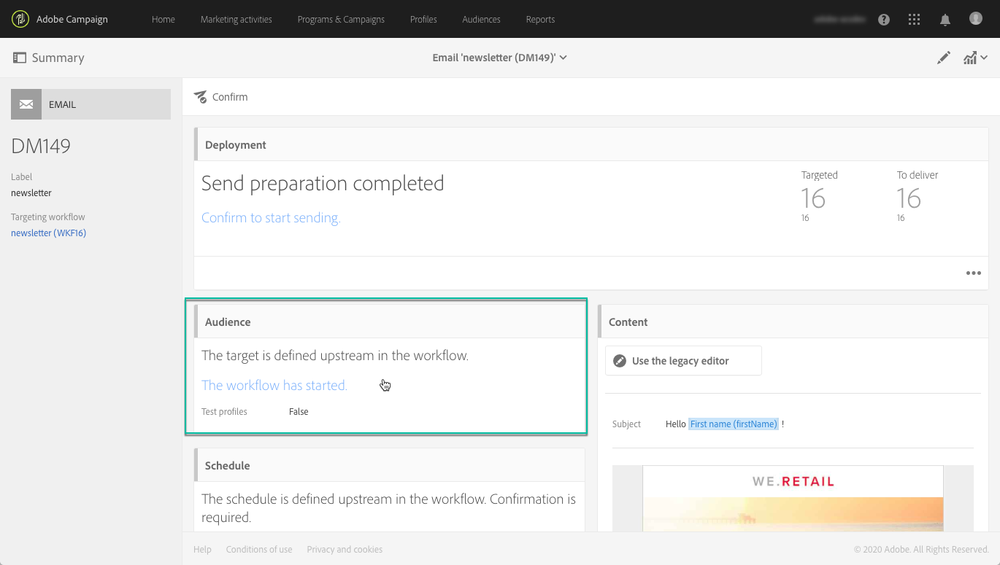

# 使用目標設定檔測試電子郵件訊息 {#testing-message-profiles}

## 概覽 {#overview}

除了[測試設定檔](../../audiences/using/managing-test-profiles.md)之外，您可以將自己置於其中一個目標設定檔的位置，以測試電子郵件訊息。 這可讓您取得設定檔將收到之訊息的精確表示（自訂欄位、動態和個人化資訊，包括工作流程的其他資料……）。

>[!NOTE]
>
> 此功能僅適用於電子郵件訊息。

主要步驟如下：

1. 設定您的訊息，然後啟動&#x200B;**準備**&#x200B;階段。
1. **在訊息所定位** 的設定檔中選取一或多個設定檔。
1. 將校樣傳送至的&#x200B;**替代地址**&#x200B;與每個設定檔關聯。
1. （選用）對於每個設定檔，定義&#x200B;**前置詞**&#x200B;以新增至校樣主旨行。
1. **** 預覽電子郵件設計工具如何為設定檔顯示訊息。
1. 傳送校樣。

>[!IMPORTANT]
>
>此功能可以讓您將個人資料傳送至外部電子郵件地址。請記住，在Campaign Standard 執行隱私權要求 (GDPR和CCPA) 不會在外部執行該要求。

 [在影片中探索此功能](#video)

## 選擇配置檔案和替代地址 {#selecting-profiles}

若要使用目標設定檔進行測試，您必須先選取設定檔，然後定義將接收校樣的替代地址。 若要這麼做，您可以在目標設定檔中選取特定設定檔](#selecting-individual-profiles)，或從現有對象](#importing-from-audience)匯入設定檔[。[

>[!NOTE]
>
>您最多可以選取100個設定檔進行測試。

### 選取個別設定檔 {#selecting-individual-profiles}

1. 在訊息控制面板中，確認訊息準備成功，然後按一下&#x200B;**[!UICONTROL Audience]**&#x200B;區塊。

   

1. 在&#x200B;**[!UICONTROL Profile substitutions]**&#x200B;標籤中，按一下&#x200B;**[!UICONTROL Create element]**&#x200B;按鈕以選取要用於測試的設定檔。

   

1. 按一下設定檔選取按鈕，以顯示訊息所定位的設定檔清單。

   

1. 選擇要用於測試的配置檔案，然後在&#x200B;**[!UICONTROL Address]**&#x200B;欄位中輸入所需的替代地址，然後按一下&#x200B;**[!UICONTROL Confirm]**。 所有以設定檔為目標的校樣都會傳送至此電子郵件地址，而非此設定檔的資料庫中定義的校樣。

   如果要為校樣的主旨行新增特定首碼，請填入&#x200B;**[!UICONTROL Subject line prefix]**&#x200B;欄位。

   >[!NOTE]
   >
   >主旨行首碼最多可包含500個字元。

   

   首碼將顯示如下：

   

1. 會將設定檔新增至清單，並附上相關聯的替代地址和前置詞。 對您要用於測試的所有設定檔重複上述步驟，然後按一下&#x200B;**[!UICONTROL Confirm]**。

   

   如果要向同一個配置檔案的多個替代地址發送校樣，必鬚根據需要多次添加此配置檔案。

   在以下範例中，根據設定檔John Smith的校樣將傳送至兩個不同的替代地址：

   

1. 定義所有設定檔和替代地址後，您就可以傳送校樣以測試訊息。 要執行此操作，請按一下&#x200B;**[!UICONTROL Test]**&#x200B;按鈕，然後選取要執行的測試類型。

   請注意，如果未將測試設定檔新增至訊息目標，則&#x200B;**[!UICONTROL Email rendering]**&#x200B;和&#x200B;**[!UICONTROL Proof + Email rendering]**&#x200B;選項將無法使用。  如需校樣傳送的詳細資訊，請參閱[此區段](../../sending/using/sending-proofs.md)。

   

>[!IMPORTANT]
>
>如果您對訊息進行任何變更，請務必再次啟動訊息準備。 否則，校樣不會反映變更。

### 從對象匯入設定檔 {#importing-from-audience}

Campaign Standard可讓您匯入可供測試的設定檔對象。 例如，這可讓您將針對不同設定檔的整組訊息傳送至唯一的電子郵件地址。

此外，如果您的對象已設定位址和首碼欄，您就可以在&#x200B;**[!UICONTROL Profile substitutions]**&#x200B;標籤中匯入這些資訊。 [本區段](#use-case)中會詳細說明使用替代地址匯入對象的範例。

>[!NOTE]
>
>匯入對象時，只會選取與訊息目標對應的設定檔，並新增至&#x200B;**[!UICONTROL Profile substitutions]**&#x200B;標籤。

若要匯入要用於從對象測試的設定檔，請遵循下列步驟：

1. 在訊息控制面板中，確認訊息準備成功，然後按一下&#x200B;**[!UICONTROL Audience]**&#x200B;區塊。

   

1. 在 **[!UICONTROL Profile substitutions]** 索引標籤中，按一下 **[!UICONTROL Import from an audience]**。

   

1. 選取要使用的對象，然後輸入要用於傳送給對象的校樣的替代地址和前置詞。

   >[!NOTE]
   >
   >主旨行首碼最多可包含500個字元。

   

   如果對象中已定義要使用的替代地址和/或前置詞，請選取&#x200B;**[!UICONTROL From Audience]**&#x200B;選項，然後指定要用來擷取這些資訊的欄。

   

1. 按一下 **[!UICONTROL Import]** 按鈕。來自與訊息目標對應之對象的設定檔會新增至&#x200B;**[!UICONTROL Profile substitution]**&#x200B;標籤，以及相關的替代地址和前置詞。

>[!NOTE]
>
>如果您再次匯入相同的對象，且含有不同的替代地址和/或字首，則除了先前匯入的設定檔外，設定檔還將新增至清單。

## 使用目標設定檔預覽訊息

>[!NOTE]
>
>預覽僅適用於電子郵件設計工具。

若要使用目標設定檔預覽訊息，請確定您已將這些設定檔新增至&#x200B;**[!UICONTROL Profile substitution]**&#x200B;清單（請參閱[定義設定檔和替代位址](#selecting-profiles)）。

如果您想在訊息中使用個人化欄位，必須在&#x200B;**啟動訊息準備之前新增這些欄位。**&#x200B;否則，預覽不會將其納入考量。 因此，如果個人化欄位有任何變更，請務必再次啟動訊息準備。

若要使用設定檔替代來預覽訊息，請遵循下列步驟：

1. 在訊息控制面板中，按一下內容快照以在電子郵件設計工具中開啟訊息。

   

1. 選擇&#x200B;**[!UICONTROL Preview]**&#x200B;頁簽，然後按一下&#x200B;**[!UICONTROL Change profile]**。

   

1. 按一下&#x200B;**[!UICONTROL Profile Substitution]**&#x200B;標籤以顯示已新增用於測試的替代設定檔。

   選擇要用於預覽的配置檔案，然後按一下&#x200B;**[!UICONTROL Select]**。

   

1. 訊息的預覽隨即顯示。 使用箭頭在選取的設定檔之間導覽。

   

## 使用案例 {#use-case}

在此使用案例中，我們想傳送個人化電子郵件電子報給一組特定設定檔。 傳送電子報之前，我們想使用部分目標設定檔來預覽，並傳送校樣至外部檔案中定義的內部電子郵件地址。

此使用案例的主要步驟如下：

1. 建立要用於測試的對象。
1. 建立工作流程以定位設定檔並傳送電子報。
1. 設定訊息的設定檔替代。
1. 使用目標設定檔預覽訊息。
1. 傳送校樣。

### 步驟1:建立要用於測試的對象

1. 準備要匯入的檔案以建立對象。 在本例中，它應包含要用於校樣的替代地址，以及要新增至校樣主旨行的前置詞。

   在此範例中，「oliver.vaughan@internal.com」電子郵件地址會收到以「john.doe@mail.com」電子郵件地址為目標之設定檔之訊息的證明。 「JD」首碼將新增至校樣的主旨行。

   

1. 建立工作流程以從檔案建立對象。 若要這麼做，請新增並設定下列活動：

   * **[!UICONTROL Load file]** 活動：匯入CSV檔案(如需此活動的詳細資訊，請參 [閱本區段](../../automating/using/load-file.md))。
   * **[!UICONTROL Reconciliation]** 活動：將檔案中的資訊連結到資料庫中的資訊。在此範例中，使用設定檔的電子郵件地址作為調解欄位（如需此活動的詳細資訊，請參閱[此區段](../../automating/using/reconciliation.md)）。
   * **[!UICONTROL Save audience]** 活動：根據匯入的檔案建立對象(如需此活動的詳細資訊，請參 [閱本區段](../../automating/using/save-audience.md))。

   

1. 執行工作流程，然後前往&#x200B;**[!UICONTROL Audiences]**&#x200B;標籤，檢查對象是否已使用所需資訊建立。

   在此範例中，對象由三個設定檔組成。 每個校樣都會連結至接收校樣的替代電子郵件地址，且校樣的主旨行中會加上前置詞。

   

### 步驟2:建立工作流程以定位設定檔並傳送電子報

1. 新增&#x200B;**[!UICONTROL Query]**&#x200B;和&#x200B;**[!UICONTROL Email delivery]**&#x200B;活動，然後根據您的需求進行設定（請參閱[Query](../../automating/using/query.md)和[電子郵件傳送](../../automating/using/email-delivery.md)區段）。

   

1. 執行工作流程，並確認訊息準備成功。

### 步驟3:設定訊息的設定檔替代索引標籤

1. 開啟&#x200B;**[!UICONTROL Email delivery]**&#x200B;活動。 在訊息控制面板中，按一下&#x200B;**[!UICONTROL Audience]**&#x200B;區塊。

   

1. 選擇&#x200B;**[!UICONTROL Profile substitutions]**&#x200B;頁簽，然後按一下&#x200B;**[!UICONTROL Import from an audience]**。

   

1. 在&#x200B;**[!UICONTROL Audience]**&#x200B;欄位中，選取從檔案建立的對象。

   

1. 定義傳送校樣時使用的替代地址和主旨行首碼。

   若要這麼做，請選取&#x200B;**[!UICONTROL From audience]**&#x200B;選項，然後從包含資訊的對象中選取欄。

   

1. 按一下 **[!UICONTROL Import]** 按鈕。對象中的設定檔會新增至清單，及其相關聯的替代地址和主旨行前置詞。

   

   >[!NOTE]
   >
   >在我們的案例中，來自對象的所有設定檔皆被&#x200B;**[!UICONTROL Query]**&#x200B;活動鎖定。 如果其中一個設定檔不是訊息目標的一部分，則不會將其新增至清單。

### 步驟4:使用目標設定檔預覽訊息

1. 在訊息控制面板中，按一下內容快照以在電子郵件設計工具中開啟訊息。

   

1. 選擇&#x200B;**[!UICONTROL Preview]**&#x200B;頁簽，然後按一下&#x200B;**[!UICONTROL Change profile]**。

   

1. 按一下&#x200B;**[!UICONTROL Profile Substitution]**&#x200B;標籤以顯示先前已新增的替代設定檔。

   選擇要用於預覽的配置檔案，然後按一下&#x200B;**[!UICONTROL Select]**。

   

1. 訊息的預覽隨即顯示。 使用箭頭在選取的設定檔之間導覽。

   

### 步驟5:傳送校樣

1. 在訊息控制面板中，按一下&#x200B;**[!UICONTROL Test]**&#x200B;按鈕，然後確認。

   

1. 校樣會根據&#x200B;**[!UICONTROL Profile substitutions]**&#x200B;索引標籤中已設定的內容傳送。

   

## 教學課程影片 {#video}

此影片說明如何使用設定檔替代來測試您的電子郵件訊息。

>[!VIDEO](https://video.tv.adobe.com/v/32368?quality=12)

其他Campaign Standard操作說明影片可在[此處](https://experienceleague.adobe.com/docs/campaign-standard-learn/tutorials/overview.html?lang=zh-Hant)取得。
