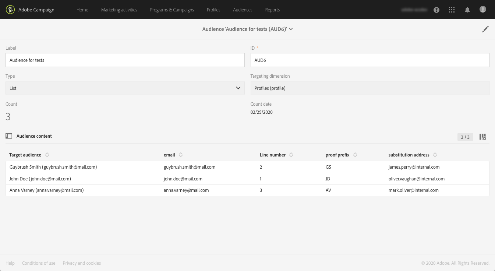

# 使用目標設定檔測試電子郵件訊息 {#testing-message-profiles}

## 概觀 {#overview}

除了測 [試描述檔](../../audiences/using/managing-test-profiles.md)，您還可以將自己置於其中一個目標描述檔的位置，以測試電子郵件訊息。 這可讓您精確呈現描述檔將收到的訊息（自訂欄位、動態和個人化資訊，包括工作流程的其他資料……）。

>[!NOTE]
>
> 此功能僅適用於電子郵件訊息。

主要步驟如下：

1. 設定您的訊息，然後啟動「準 **備** 」階段。
1. **在訊息所定位的描述檔中** ，選取一或數個描述檔。
1. 將校樣傳送到 **的替代地址** ，與每個配置檔案關聯。
1. （可選）針對每個描述檔，定 **義首碼** ，以新增至校對主旨行。
1. **在「電子郵件設計器** 」中預覽描述檔的訊息顯示方式。
1. 傳送校樣。

如需全域程式的詳細資訊，請參閱此處提供的教學課程 [影片](https://docs.adobe.com/content/help/zh-Hant/campaign-standard-learn/tutorials/communication-channels/email/profile-substitution.translate.html)。

>[!IMPORTANT]
>
>此功能可以讓您將個人資料傳送至外部電子郵件地址。請記住，在Campaign Standard 執行隱私權要求 (GDPR和CCPA) 不會在外部執行該要求。

## 選擇配置檔案和替代地址 {#selecting-profiles}

若要使用目標描述檔進行測試，您必須先選取它們，然後定義接收校樣的替代位址。 若要這麼做，您可以在目標 [設定檔中選取特定設定檔](#selecting-individual-profiles) ，或從現 [有對象匯入設定檔](#importing-from-audience)。

>[!NOTE]
>
>您最多可以選取100個描述檔進行測試。

### 選擇個別描述檔 {#selecting-individual-profiles}

1. 在訊息控制面板中，請確定訊息準備成功，然後按一下 **[!UICONTROL Audience]** 區塊。

   

1. 在標籤 **[!UICONTROL Profile substitutions]** 中，按一下按 **[!UICONTROL Create element]** 鈕以選取要用於測試的描述檔。

   

1. 按一下描述檔選擇按鈕，以顯示訊息所定位的描述檔清單。

   

1. 選擇要用於測試的配置檔案，然後在欄位中輸入 **[!UICONTROL Address]** 所需的替代地址，然後按一下 **[!UICONTROL Confirm]**。 所有針對描述檔的校樣都會傳送至此電子郵件地址，而非此描述檔資料庫中定義的校樣。

   如果要在校樣的主題行中添加特定的前置詞，請填寫該字 **[!UICONTROL Subject line prefix]** 段。

   >[!NOTE]
   >
   >主旨行首碼最多可包含500個字元。

   

   首碼將顯示如下：

   

1. 配置式將添加到清單中，並帶有其關聯的替代地址和前置詞。 對要用於測試的所有配置檔案重複上述步驟，然後按一下 **[!UICONTROL Confirm]**。

   

   如果要向同一個配置檔案的多個替代地址發送證明，必鬚根據需要多次添加此配置檔案。

   在以下示例中，基於配置檔案John Smith的證明將發送到兩個不同的替代地址：

   

1. 定義完所有描述檔和替代地址後，您就可以傳送證明來測試訊息。 若要這麼做，請按一 **[!UICONTROL Test]** 下按鈕，然後選取要執行的測試類型。

   請注意，如果未將測試描述檔新增至訊息目標，則 **[!UICONTROL Email rendering]** 無法 **[!UICONTROL Proof + Email rendering]** 使用和選項。  For more information on proofs sending, refer to [this section](../../sending/using/sending-proofs.md).

   

>[!IMPORTANT]
>
>如果您對訊息做了任何變更，請務必再次啟動訊息準備。 否則，這些變更將不會反映在證明中。

### 從觀眾匯入個人檔案 {#importing-from-audience}

Campaign Standard可讓您匯入可用於測試的設定檔對象。 例如，這可讓您傳送至唯一的電子郵件地址，以不同描述檔為目標的整組訊息。

此外，如果您的觀眾已設定了位址和首碼欄，您就可以在標籤中匯入這些 **[!UICONTROL Profile substitutions]** 資訊。 本節將詳細說明使用替代位址匯入觀眾 [的範例](#use-case)。

>[!NOTE]
>
>匯入對象時，只會選取與訊息目標對應的描述檔並新增至標 **[!UICONTROL Profile substitutions]** 簽。

若要匯入設定檔，以便從觀眾進行測試，請遵循下列步驟：

1. 在訊息控制面板中，請確定訊息準備已成功，然後按一下 **[!UICONTROL Audience]** 區塊。

   

1. 在 **[!UICONTROL Profile substitutions]** 索引標籤中，按一下 **[!UICONTROL Import from an audience]**。

   

1. 選取要使用的對象，然後輸入要用於傳送給對象的校樣的替代地址和前置詞。

   >[!NOTE]
   >
   >主旨行首碼最多可包含500個字元。

   

   如果要使用的替代地址和／或前置詞已在您的對象中定義，請選 **[!UICONTROL From Audience]** 擇選項，然後指定用於檢索這些資訊的列。

   

1. 按一下 **[!UICONTROL Import]** 按鈕。來自對應於消息目標的觀眾的概要檔案被添加到標 **[!UICONTROL Profile substitution]** 簽，以及相關聯的替代地址和前置詞。

>[!NOTE]
>
>如果您再次匯入相同的對象，並使用不同的替代位址和／或前置詞，則除了先前匯入的訪客外，設定檔也會新增至清單。

## 使用目標設定檔預覽訊息

>[!NOTE]
>
>預覽僅適用於電子郵件設計器。

若要能夠使用目標描述檔預覽訊息，請確定您已將這些描述檔新增至清單(請參 **[!UICONTROL Profile substitution]** 閱定 [義描述檔和替代位址](#selecting-profiles))。

如果您想在訊息中使用個人化欄位，則必須先新增欄位， **才能啟** 動訊息準備。 否則，預覽中不會考量這些項目。 因此，如果對個人化欄位進行任何變更，請務必再次啟動訊息準備。

要使用配置檔案替代來預覽消息，請執行以下步驟：

1. 在訊息控制面板中，按一下內容快照，在電子郵件設計工具中開啟訊息。

   

1. Select the **[!UICONTROL Preview]** tab, then click **[!UICONTROL Change profile]**.

   

1. 按一下該 **[!UICONTROL Profile Substitution]** 頁籤可顯示已添加用於測試的替代配置檔案。

   選擇要用於預覽的配置檔案，然後按一下 **[!UICONTROL Select]**。

   

1. 會顯示訊息的預覽。 使用箭頭在所選配置檔案之間導航。

   

## 使用案例 {#use-case}

在此使用案例中，我們想傳送個人化電子郵件電子報給一組特定個人檔案。 在傳送電子報之前，我們想使用部分目標設定檔來預覽電子報，並傳送校樣至外部檔案中定義的內部電子郵件地址。

此使用案例的主要步驟如下：

1. 建立要用於測試的觀眾。
1. 建立工作流程，以定位描述檔並傳送電子報。
1. 配置消息的配置檔案替代。
1. 使用目標描述檔預覽訊息。
1. 傳送校樣。

### 步驟1:建立要用於測試的觀眾

1. 準備要匯入的檔案以建立觀眾。 在本例中，它應包含用於證明的替代地址，以及要添加到證明主題行中的前置詞。

   在此範例中，「oliver.vaughan@internal.com」電子郵件地址會收到以「john.doe@mail.com」電子郵件地址為目標之描述檔之訊息的證明。 「JD」首碼將添加到證明的主題行。

   

1. 建立工作流程，從檔案建立觀眾。 若要這麼做，請新增及設定下列活動：

   * **[!UICONTROL Load file]** 活動：匯入CSV檔案(如需此活動的詳細資訊，請參閱 [本節](../../automating/using/load-file.md))。
   * **[!UICONTROL Reconciliation]** 活動：將檔案中的資訊連結到資料庫中的資訊。 在此範例中，我們將使用描述檔的電子郵件地址做為協調欄位(如需此活動的詳細資訊，請參 [閱本節](../../automating/using/reconciliation.md))。
   * **[!UICONTROL Save audience]** 活動：根據匯入的檔案建立對象(如需此活動的詳細資訊，請參 [閱本節](../../automating/using/save-audience.md))。

   

1. 執行工作流程，然後前往標 **[!UICONTROL Audiences]** 簽，以檢查對象是否已使用所需資訊建立。

   在此範例中，觀眾由三個個人檔案組成。 每個證明都會連結至替代電子郵件地址，以接收證明，並在證明的主旨行中使用前置詞。

   

### 步驟2:建立工作流程以鎖定描述檔並傳送電子報

1. 新增 **[!UICONTROL Query]** 和 **[!UICONTROL Email delivery]** 活動，然後根據您的需求進行設定(請參閱「查詢 [」和「](../../automating/using/query.md) 電子郵件傳送  」區段)。

   

1. 運行工作流並確保消息準備成功。

### 步驟3:配置消息的「配置檔案替代」頁籤

1. 開啟活 **[!UICONTROL Email delivery]** 動。 In the message dashboard, click the **[!UICONTROL Audience]** block.

   

1. Select the **[!UICONTROL Profile substitutions]** tab, then click **[!UICONTROL Import from an audience]**.

   

1. 在欄位 **[!UICONTROL Audience]** 中，選取從檔案建立的對象。

   

1. 定義發送校樣時使用的替代地址和主題行前置詞。

   若要這麼做，請選取 **[!UICONTROL From audience]** 選項，然後從包含資訊的對象中選取欄。

   

1. 按一下 **[!UICONTROL Import]** 按鈕。來自觀眾的個人檔案會新增至清單，並加上其相關的替代地址和主旨行字首。

   

   >[!NOTE]
   >
   >在本例中，觀眾的所有個人檔案都是活動的目 **[!UICONTROL Query]** 標。 如果其中一個描述檔不屬於訊息目標，則不會將其新增至清單。

### 步驟4:使用目標描述檔預覽訊息

1. 在訊息控制面板中，按一下內容快照，在電子郵件設計工具中開啟訊息。

   

1. Select the **[!UICONTROL Preview]** tab, then click **[!UICONTROL Change profile]**.

   

1. 按一下該 **[!UICONTROL Profile Substitution]** 頁籤可顯示以前添加的替代配置檔案。

   選擇要用於預覽的配置檔案，然後按一下 **[!UICONTROL Select]**。

   

1. 會顯示訊息的預覽。 使用箭頭在所選配置檔案之間導航。

   

### 步驟5:傳送校樣

1. In the message dashboard, click the **[!UICONTROL Test]** button, then confirm.

   

1. 校樣會根據標籤中已設定的內容來 **[!UICONTROL Profile substitutions]** 傳送。

   
