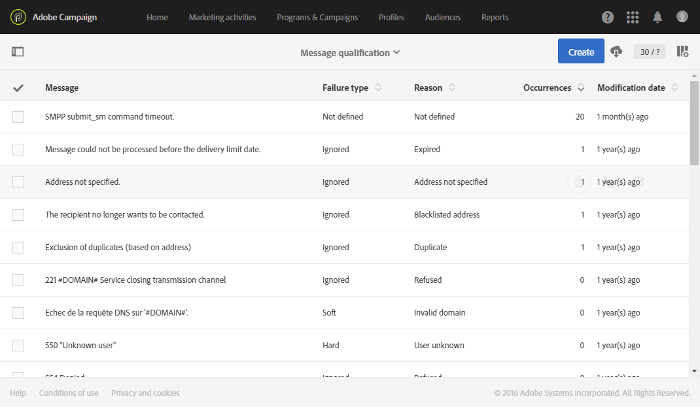

# 瞭解傳送故障{#understanding-delivery-failures}

## 關於傳送失敗 {#about-delivery-failures}

當傳送無法傳送至描述檔時，遠端伺服器會自動傳送錯誤訊息，此錯誤訊息會由Adobe Campaign平台擷取，並符合資格決定是否隔離電子郵件地址或電話號碼。 請參 [閱Bounce郵件資格](#bounce-mail-qualification)。

>[!NOTE]
>
>**電子郵件** 錯誤訊息（或「彈回數」）由「增強的MTA」（同步彈回數）或inMail程式（非同步彈回數）限定。
>
>**MTA流程** （或「狀態報告」的「SR」）會限定SMS錯誤訊息。

如果地址被隔離或配置檔案被列入黑名單，在準備傳送時也可以排除郵件。 已排除的訊息會列在 **[!UICONTROL Exclusion logs]** 傳送控制面板的標籤中(請參 [閱本節](../../sending/using/monitoring-a-delivery.md#exclusion-logs))。

**相關主題：**

* [瞭解隔離管理](../../sending/using/understanding-quarantine-management.md)
* [管理促銷活動中的黑名單](../../audiences/using/about-opt-in-and-opt-out-in-campaign.md)

## 識別訊息的傳送失敗 {#identifying-delivery-failures-for-a-message}

傳送傳送後，標籤(請 **[!UICONTROL Sending logs]** 參閱本 [節](../../sending/using/monitoring-a-delivery.md#sending-logs))可讓您檢視每個描述檔的傳送狀態，以及相關的失敗類型和原因(請參閱傳送失敗類型 [和原因](#delivery-failure-types-and-reasons))。

此外，也提供專屬的現成可用報表。 此報表詳細說明傳送期間遇到的整體硬式和軟式錯誤，以及自動處理彈回數。 如需詳細資訊，請參閱[本小節](../../reporting/using/bounce-summary.md)。

## 傳送失敗類型和原因 {#delivery-failure-types-and-reasons}

傳送失敗時有三種錯誤類型：

* **硬**: 「硬」錯誤表示地址無效。 這包含明確指出地址無效的錯誤訊息，例如： &quot;未知用戶&quot;。
* **軟**: 這可能是暫時錯誤，或無法分類的錯誤，例如： 「無效域」或「郵箱已滿」。
* **已忽略**: 這是已知為暫時的錯誤，例如「不在辦公室」，或是技術錯誤，例如，如果傳送者類型是「postmaster」。

傳送失敗的可能原因有：

| 錯誤標籤 | 錯誤類型 | 說明 |
---------|----------|---------
| **[!UICONTROL User unknown]** | 硬 | 地址不存在。 此描述檔不會再嘗試傳送。 |
| **[!UICONTROL Quarantined address]** | 硬 | 地址已置於隔離區。 |
| **[!UICONTROL Unreachable]** | 軟／硬 | 消息傳送鏈中發生錯誤（例如暫時無法訪問域）。 根據提供者傳回的錯誤，將直接傳送地址給隔離，或者重新嘗試傳送，直到Campaign收到證明隔離狀態正確的錯誤或錯誤數達到5為止。 |
| **[!UICONTROL Address empty]** | 硬 | 未定義地址。 |
| **[!UICONTROL Mailbox full]** | Soft | 此用戶的郵箱已滿，無法接受更多消息。 可以從隔離清單中刪除此地址，以進行另一次嘗試。 在30天後自動移除。 In order for the address to be automatically removed from the list of quarantined addresses, the **[!UICONTROL Database cleanup]** technical workflow must be started. |
| **[!UICONTROL Refused]** | 軟／硬 | 由於安全反饋是垃圾郵件報告，該地址已被置於隔離狀態。 根據提供者傳回的錯誤，將直接傳送地址給隔離，或者重新嘗試傳送，直到Campaign收到證明隔離狀態正確的錯誤或錯誤數達到5為止。 |
| **[!UICONTROL Duplicate]** | 已忽略 | 區段中已偵測到該位址。 |
| **[!UICONTROL Not defined]** | Soft | 該地址正在限定中，因為錯誤尚未增加。 當伺服器傳送新錯誤訊息時，會發生此類錯誤： 它可能是孤立的錯誤，但如果再次發生，錯誤計數器會增加，這會提醒技術團隊。 |
| **[!UICONTROL Error ignored]** | 已忽略 | 此地址位於白名單中，無論如何，都會寄送電子郵件給此地址。 |
| **[!UICONTROL Blacklisted address]** | 硬 | 地址在發送時被列入黑名單。 |
| **[!UICONTROL Account disabled]** | 軟／硬 | 當Internet訪問提供程式(IAP)檢測到長時間的不活動時，它可以關閉用戶帳戶： 傳送至使用者位址的作業將無法進行。 「軟」或「硬」類型取決於收到的錯誤類型： 如果帳戶因為6個月的閒置而暫時停用，而且仍可啟動，則會指派狀 **[!UICONTROL Erroneous]** 態並再次嘗試傳送。 如果收到錯誤信號表明帳戶已永久停用，則會直接將其發送到隔離。 |
| **[!UICONTROL Not connected]** | 已忽略 | 當傳送訊息時，描述檔的行動電話已關閉或未連線至網路。 |
| **[!UICONTROL Invalid domain]** | Soft | 電子郵件地址的網域不正確或已不存在。 此描述檔將再次定位，直到錯誤計數達到5。 之後，記錄將設定為「隔離」狀態，不會再重試。 |
| **[!UICONTROL Text too long]** | 已忽略 | SMS訊息中的字元數量超過限制。 如需詳細資訊，請參 [閱SMS編碼、長度和音譯](../../administration/using/configuring-sms-channel.md#sms-encoding--length-and-transliteration)。 |
| **[!UICONTROL Character not supported by encoding]** | 已忽略 | SMS訊息包含一或多個編碼不支援的字元。 有關詳細資訊，請參 [閱字元表- GSM標準](../../administration/using/configuring-sms-channel.md#table-of-characters---gsm-standard)。 |

## 傳送暫時失敗後重試 {#retries-after-a-delivery-temporary-failure}

如果消息因「已忽略」類型的臨時錯誤而失 **敗** ，則在傳送期間將執行重試。 如需錯誤類型的詳細資訊，請參閱傳 [送失敗類型和原因](#delivery-failure-types-and-reasons)。

Adobe Campaign Enhanced MTA現在會根據IP在歷史和目前指定網域的執行狀況，管理重試次數（在發送開始後應執行多少次重試）和兩次重試之間的最小延遲。 會忽 **略促銷活動** 中的「重試次數」設定。

要修改傳送的持續時間，請轉至傳送或傳送模板的高級參數，並編輯「有 **[!UICONTROL Delivery duration]** 效期間」 [部分的欄位](../../administration/using/configuring-email-channel.md#validity-period-parameters) 。

>[!IMPORTANT]
>
>**您&#x200B;**[!UICONTROL Delivery duration]**的促銷活動傳送中的參數現在僅在設為3.5天或更少時使用。** 如果您定義的值高於3.5天，則不會考慮該值，因為Adobe Campaign Enhanced MTA現在會管理它。

例如，如果您希望某個傳送的重試在一天後停止，您可以將傳送持續時間設為 **1d**，而「增強型MTA」會在一天後移除重試佇列中的訊息，以遵守該設定。

>[!NOTE]
>
>當訊息在「增強MTA」佇列中停留3.5天且無法傳送時，訊息會逾時，其狀態會從傳送記錄檔 **[!UICONTROL Sent]** 中 **[!UICONTROL Failed]** 更 [新為](../../sending/using/monitoring-a-delivery.md#delivery-logs)。

<!--The default configuration allows five retries at one-hour intervals, followed by one retry per day for four days. The number of retries can be changed globally (contact your Adobe technical administrator) or for each delivery or delivery template (see [this section](../../administration/using/configuring-email-channel.md#sending-parameters)).-->

## 同步與非同步錯誤 {#synchronous-and-asynchronous-errors}

傳送可能會立即失敗（同步錯誤），或稍後傳送失敗（非同步錯誤）。

* **同步錯誤**: 由Adobe Campaign傳送伺服器連絡的遠端伺服器會立即傳回錯誤訊息，不允許傳送至描述檔的伺服器。
* **非同步錯誤**: 接收伺服器稍後會重新發送彈回郵件或SR。 傳送後一週內，可能會發生非同步錯誤。

## 彈回郵件資格 {#bounce-mail-qualification}

對於同步傳送失敗錯誤訊息，「增強的MTA」會決定反彈類型和資格，並將該資訊傳回至「促銷活動」。

inMail程式仍會透過規則來限定非同步彈 **[!UICONTROL Inbound email]** 回數。 若要存取這些規則，請按一 **[!UICONTROL Adobe Campaign]** 下左上角的標誌，然後選取 **[!UICONTROL Administration > Channels > Email > Email processing rules]** 並選取 **[!UICONTROL Bounce mails]**。 For more on this rule, refer to this [section](../../administration/using/configuring-email-channel.md#email-processing-rules).

>[!NOTE]
>
>Adobe Campaign Enhanced MTA現在會管理彈回郵件資格。 「促銷活動」表格中的 **[!UICONTROL Message qualification]** 反彈資格不再使用。

<!--Bounces can have the following qualification statuses:

* **[!UICONTROL To qualify]**: the bounce mail needs to be qualified. Qualification must be done by the Deliverability team to ensure that the platform deliverability functions correctly. As long as it is not qualified, the bounce mail is not used to enrich the list of email processing rules.
* **[!UICONTROL Keep]**: the bounce mail was qualified and will be used by the **Update for deliverability** workflow to be compared to existing email processing rules and enrich the list.
* **[!UICONTROL Ignore]**: the bounce mail was qualified but will not be used by the **Update for deliverability** workflow. So it will not be sent to the client instances.

To list the various bounces and their associated error types et reasons, click the **[!UICONTROL Adobe Campaign]** logo, in the top left, then select **[!UICONTROL Administration > Channels > Quarantines > Message qualification]**.

-->

## 利用雙重加入機制優化郵件傳遞能力 {#optimizing-mail-deliverability-with-double-opt-in-mechanism}

傳送電子郵件時，最佳做法是雙重加入機制。 它可保護平台免受錯誤或無效的電子郵件地址、垃圾郵件機器人，並防止可能的垃圾郵件投訴。

原則是先傳送電子郵件確認訪客的同意，再將其儲存為「描述檔」至您的促銷活動資料庫： 訪客填寫線上登陸頁面，接著收到電子郵件，必須按一下確認連結才能完成訂閱。

如需詳細資訊，請參閱[本小節](../../channels/using/setting-up-a-double-opt-in-process.md)。
