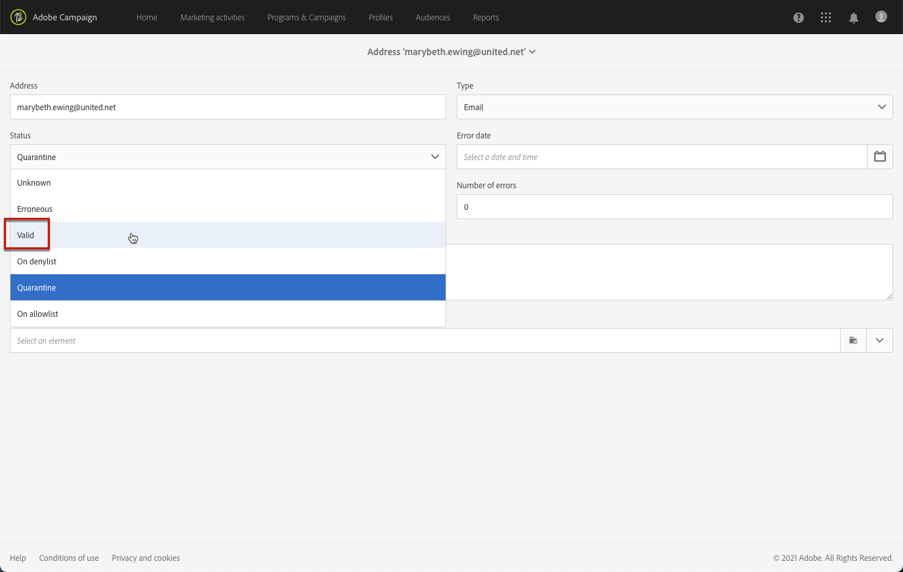

# 瞭解隔離管理{#understanding-quarantine-management}

## 關於隔離 {#about-quarantines}

例如信箱容量已滿或地址不存在時，您可以隔離電子郵件地址。

在任何情況下，隔離程序都符合本區段 [所述的特定規則](#conditions-for-sending-an-address-to-quarantine)。

### 透過隔離最佳化傳送 {#optimizing-your-delivery-through-quarantines}

郵件準備期間會自動排除其電子郵件地址或電話號碼處於隔離狀態的設定檔（請參閱[識別傳送的隔離地址](#identifying-quarantined-addresses-for-a-delivery)）。這會加快傳送速度，因為錯誤率對傳送速度有顯著影響。

如果無效地址的比率過高，某些網際網路存取提供者會自動將電子郵件視為垃圾郵件。因此，隔離允許您避免被這些提供程式添加到denylist中。

此外，隔離有助於減少簡訊傳送成本，因為將錯誤的電話號碼排除在遞送服務之外。

如需確保傳送安全並最佳化的最佳實務，請參閱[本頁面](../../sending/using/delivery-best-practices.md)。

### 隔離與密尼列斯特 {#quarantine-vs-denylist}

隔離和密文清單不適用於同一對象：

* **隔離** 僅適用於 **地址** （或電話號碼等等），而不是個人資料本身。 例如，其電子郵件地址被隔離的配置檔案可以更新其配置檔案並輸入新地址，然後可以再次通過傳遞操作鎖定。 同樣，如果兩個配置檔案的電話號碼相同，則如果隔離該號碼，則兩個配置檔案都會受到影響。

   隔離的地址或電話號碼顯示在 [排除日誌](#identifying-quarantined-addresses-for-a-delivery) （交貨）或 [隔離清單](#identifying-quarantined-addresses-for-the-entire-platform) （適用於整個平台）。

* 在 **密度**，另一方面， **輪廓** 不再被指定渠道的交付所針對，如取消訂閱（選擇退出）後。 例如，如果電子郵件渠道的denylist上的配置檔案有兩個電子郵件地址，則兩個地址都將排除在傳遞之外。 有關denylist進程的詳細資訊，請參閱 [關於選擇加入和選擇退出活動](../../audiences/using/about-opt-in-and-opt-out-in-campaign.md)。

   您可以檢查配置檔案是否位於密鑰清單中，以查看 **[!UICONTROL No longer contact (on denylist)]** 的 **[!UICONTROL General]** 頁籤。 請參閱[本節](../../audiences/using/managing-opt-in-and-opt-out-in-campaign.md#managing-opt-in-and-opt-out-from-a-profile)。

>[!NOTE]
>
>隔離包括 **登錄** 狀態，當收件人將您的郵件報告為垃圾郵件或使用關鍵字（如「STOP」）回復SMS郵件時，該狀態適用。 在這種情況下，配置檔案的相關地址或電話號碼將與 **[!UICONTROL On denylist]** 狀態。 有關管理STOP SMS消息的詳細資訊，請參閱 [此部分](../../channels/using/managing-incoming-sms.md#managing-stop-sms)。

&lt;! — 當用戶使用STOP等關鍵字回復SMS消息以選擇退出SMS遞送時，其配置檔案不會像電子郵件選擇退出過程中那樣添加到密尼清單中。 相反，配置檔案的電話號碼將與 **[!UICONTROL On denylist]** 狀態。 此狀態僅指電話號碼，這意味著配置檔案將繼續接收電子郵件。<!-- Also, if the profile has another phone number, he can still receive SMS messages on the other number. For more on this, refer to [this section](../../channels/using/managing-incoming-sms.md#managing-stop-sms).-->

## 識別隔離地址 {#identifying-quarantined-addresses}

可以為特定傳送或整個平台顯示隔離地址。

<!--
If you need to remove an address from quarantine, contact your technical administrator.
-->

### 識別傳送的隔離地址 {#identifying-quarantined-addresses-for-a-delivery}

在傳送準備階段期間，會將特定傳送的隔離地址中列在傳送控制面板的　**[!UICONTROL Exclusion logs]**　索引標籤中（請參閱[本區段](../../sending/using/monitoring-a-delivery.md#exclusion-logs)）。如需傳送準備的詳細資訊，請參閱[本區段](../../sending/using/preparing-the-send.md)。

### 識別整個平台的隔離地址 {#identifying-quarantined-addresses-for-the-entire-platform}

管理員可以從 **[!UICONTROL Administration > Channels > Quarantines > Addresses]** 的子菜單。

<!--
This menu lists quarantined elements for **Email**, **SMS** and **Push notification** channels.
-->

>[!NOTE]
>
>檢疫數量的增加是正常的效果，與資料庫的&quot;磨損&quot;有關。 例如，如果電子郵件地址的生存期被視為三年，而收件人表每年增加50%，則隔離增加的計算方法如下：年末1:(1)&#42;0.33)/(1+0.5)=22%。 年末2:(1.22)&#42;0.33)+0.33)/(1.5+0.75)=32.5%。

篩選器可幫助您瀏覽清單。 您可以對地址、狀態和/或通道進行篩選。

您可以編輯或 [刪除](#removing-a-quarantined-address) 並建立新條目。

要編輯條目，請按一下相應行並根據需要修改欄位。

要手動添加新條目，請使用 **[!UICONTROL Create]** 按鈕

定義地址（或電話號碼等） 頻道類型。 您可以設定處於隔離清單中的狀態和錯誤原因。 您還可以指示錯誤發生的日期、錯誤數，並輸入錯誤文本。 如果需要，請從下拉清單中選擇發送到地址的上次交貨。

## 從隔離中刪除地址 {#removing-a-quarantined-address}

### 自動更新 {#unquarantine-auto}

符合特定條件的地址將通過資料庫清理工作流自動從隔離清單中刪除。 瞭解有關技術工作流的更多資訊，請參見 [此部分](../../administration/using/technical-workflows.md#list-of-technical-workflows)。

在以下情況下，這些地址將自動從隔離清單中刪除：

* 中的地址 **[!UICONTROL Erroneous]** 成功交貨後，狀態將從隔離清單中刪除。
* 中的地址 **[!UICONTROL Erroneous]** 如果上次軟反彈發生時間超過10天，則狀態將從隔離清單中刪除。 有關軟錯誤管理的詳細資訊，請參見 [此部分](#soft-error-management)。
* 中的地址 **[!UICONTROL Erroneous]** 與 **[!UICONTROL Mailbox full]** 30天後將從隔離清單中刪除錯誤。

其狀態隨後更改為 **[!UICONTROL Valid]**。

最大重試次數 **[!UICONTROL Erroneous]** 現在，重試狀態和最小延遲取決於IP在給定域中的歷史和當前執行情況。

>[!IMPORTANT]
>
>地址位於 **[!UICONTROL Quarantine]** 或 **[!UICONTROL Denylisted]** 即使收到電子郵件，狀態也不會被刪除。

### 手動更新 {#unquarantine-manual}

您也可以手動取消對地址的隔離。  要手動從隔離清單中刪除地址，可以從隔離清單中刪除地址或將其狀態更改為 **[!UICONTROL Valid]**。

* 從 **[!UICONTROL Administration > Channels > Quarantines > Addresses]** 清單和選擇 **[!UICONTROL Delete element]**。

   

* 選擇地址並更改其 **[!UICONTROL Status]** 至 **[!UICONTROL Valid]**。

   

### 批量更新 {#unquarantine-bulk}

您可能需要在隔離清單上執行批量更新，例如在ISP中斷時。 在這種情況下，電子郵件被錯誤地標籤為回報，因為無法將其成功地發送給收件人。 這些地址必須從隔離清單中刪除。

要執行此操作，請建立工作流並添加 **[!UICONTROL Query]** 「隔離」表上的活動，以過濾所有受影響的收件人。 一旦確定，就可以從隔離清單中刪除它們，並將它們包含在將來的市場活動電子郵件遞送中。

根據事件的時間範圍，以下是此查詢的建議准則。

* **錯誤文本（隔離文本）** 包含「550-5.1.1」和 **錯誤文本（隔離文本）** 包含&quot;support.ISP.com&quot;

   其中，「support.ISP.com」可以是：「support.apple.com」或「support.google.com」，例如

* **更新狀態(@lastModified)** 在MM/DD/YYYY HH上或之後:MM:SS AM
* **更新狀態(@lastModified)** MM/DD/YYYY HH上或之前:MM:SS PM(SS PM)

一旦您擁有受影響收件人的清單，請添加 **[!UICONTROL Update data]** 活動將其電子郵件地址狀態設定為 **[!UICONTROL Valid]** 這樣它們就會被 **[!UICONTROL Database cleanup]** 工作流。 您也可以從隔離表中刪除它們。

## 將地址傳送到隔離區的條件 {#conditions-for-sending-an-address-to-quarantine}

Adobe Campaign 會根據傳送失敗類型和錯誤訊息限定期間指派的原因來管理隔離區（請參閱[傳送失敗類型和原因](../../sending/using/understanding-delivery-failures.md#delivery-failure-types-and-reasons)及[退信限定](../../sending/using/understanding-delivery-failures.md#bounce-mail-qualification)）。

* **忽略錯誤**：忽略的錯誤不會傳送要隔離的地址。
* **硬錯誤**：會立即將相對應的電子郵件地址傳送至隔離區。
* **軟錯誤**：軟錯誤不會立即傳送要隔離的地址，但會增加錯誤計數器。有關此的詳細資訊，請參閱 [軟錯誤管理](#soft-error-management)。

   <!--
  When the error counter reaches the limit threshold, the address goes into quarantine. In the default configuration, the threshold is set at five errors, where two errors are significant if they occur at least 24 hours apart. The address is placed in quarantine at the fifth error. The error counter threshold can be modified. For more on this, refer to this [page](../../administration/using/configuring-email-channel.md#email-channel-parameters).
  When a delivery is successful after a retry, the error counter of the address which was prior to that quarantined is reinitialized. The address status changes to **[!UICONTROL Valid]** and it is deleted from the list of quarantines after two days by the **[!UICONTROL Database cleanup]** workflow.
  -->

如果用戶將電子郵件定義為垃圾郵件([反饋環](https://experienceleague.adobe.com/docs/deliverability-learn/deliverability-best-practice-guide/transition-process/infrastructure.html#feedback-loops))，該郵件自動重定向到由Adobe管理的技術郵箱。 之後，系統會自動將使用者的電子郵件地址傳送到狀態為　**[!UICONTROL On denylist]**　的隔離區。此狀態僅指地址，配置檔案不在密碼清單中，因此用戶繼續接收SMS消息和推送通知。

>[!NOTE]
>
>Adobe Campaign　中的隔離區會區分大小寫。請務必以小寫匯入電子郵件地址，如此一來，稍後就不會將它們重新設為目標。

在隔離地址清單中（請參閱[識別整個平台的隔離地址](#identifying-quarantined-addresses-for-the-entire-platform)），**[!UICONTROL Error reason]**　欄位會表示所選地址被置於隔離區的原因。

### 軟錯誤管理 {#soft-error-management}

與硬錯誤相比，軟錯誤不會立即發送要隔離的地址，而是增加錯誤計數器。

將在 [交貨期](../../administration/using/configuring-email-channel.md#validity-period-parameters)。 當錯誤計數器達到限制臨界值時，該地址就會進入隔離區。有關此內容的詳細資訊，請參閱 [傳遞臨時失敗後重試](understanding-delivery-failures.md#retries-after-a-delivery-temporary-failure)。

<!--In the default configuration, the threshold is set at five errors, where two errors are significant if they occur at least 24 hours apart. The address is placed in quarantine at the fifth error.
The error counter threshold can be modified.-->

如果上次出現重大錯誤超過10天，則重新初始化錯誤計數器。 地址狀態隨後更改為 **有效** 而且它被從隔離清單中刪除 **資料庫清理** 工作流。 (有關技術工作流的詳細資訊，請參見 [此部分](../../administration/using/technical-workflows.md#list-of-technical-workflows)。)
