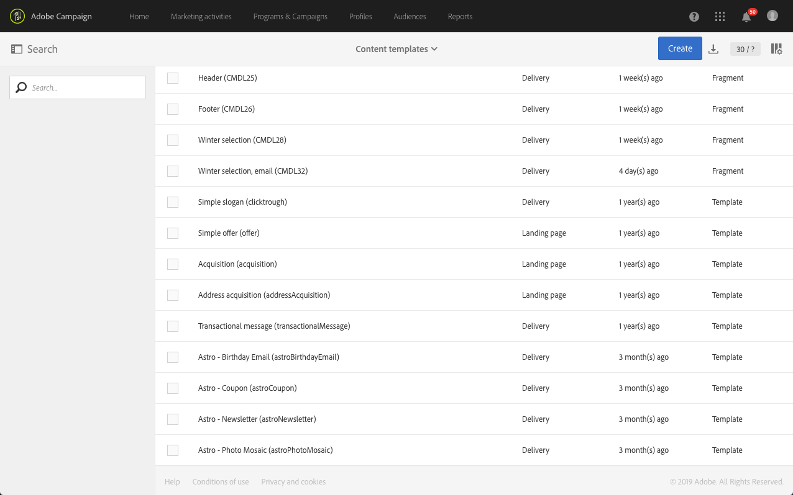

# 關於範本{#about-templates}

## 行銷活動範本 {#marketing-activity-templates}

當您建立新的行銷活動時，精靈中的第一個畫面會要求您選取類型或範本。 範本可讓您根據需求預先設定某些參數。 範本可能包含行銷活動的完整或部分設定。 模板管理由功能管理員執行。

使用者擁有簡化的介面。 建立新行銷活動時，您只需要選取要使用的範本。 無需擔心任何技術配置。 模板中的功能管理員已經預先配置了此選項。

例如，若是電子郵件範本，您可以預先填寫HTML內容、對象，以及傳送的任何其他參數：排程、測試設定檔、您的傳送的一般屬性、進階參數等。 這可讓您在建立新活動時節省時間。

對於每種行銷活動類型，只需最少的設定，就可使用一或多個現成可用的範本。 這些現成可用的範本無法修改或刪除。

範本適用於下列行銷活動：

* 計畫
* 促銷活動
* 電子郵件傳送
* 簡訊傳送
* 推播通知
* 登錄頁面
* 工作流程
* 服務
* 匯入
* 交易式訊息

這些範本是從&gt;畫面 **[!UICONTROL Resources]** 管理 **[!UICONTROL Templates]** 的。

>[!NOTE]
>
>品牌設定可以在電子郵件或登陸頁面範本中預先設定。 如需詳細資訊，請參閱「品 [牌推廣](../../administration/using/branding.md) 」一節。

## 內容範本 {#content-templates}

HTML內容範本可從「進階」功能表 **[!UICONTROL Resources]** 的&gt; **[!UICONTROL Content templates & fragments]** 畫面 [存取](../../start/using/interface-description.md#advanced-menu)。 您可以從那裡管理著陸頁面內容範本、電子郵件內容範本以及片段。

現成可用的內容範本為唯讀。 若要編輯其中一個範本，您必須先複製所要的範本。

您可以建立新的範本或片段，並定義您自己的內容。 如需詳細資訊，請參 [閱「建立內容範本](#creating-a-content-template) 」 [和「建立內容片段」](../../designing/using/using-reusable-content.md#creating-a-content-fragment)。

使用電子郵件設計工具編輯內容時，您也可以將內容儲存為片段或範本，以建立內容範本。 如需詳細資訊，請參 [閱「將內容儲存為範本](#saving-content-as-template) 」 [和「將內容儲存為片段」](../../designing/using/using-reusable-content.md#saving-content-as-a-fragment)。

### 現成可用的電子郵件內容範本 {#email-content-templates}

您可以管理「電子郵件設計器」首頁 **[!UICONTROL Templates]** 標籤中提 [供的HTML內容](../../designing/using/designing-content-in-adobe-campaign.md) 。

現成可用的電子郵件內容範本包括18種行動裝置最佳化版面，以及4種Behance藝術家設計的同級最佳回應範本。 它們符合最新的使用方式，例如客戶歡迎訊息、電子報和重新參與電子郵件等。 您可以輕鬆自訂品牌內容，以簡化從頭設計電子郵件的程式。

**相關主題：**

* 瞭解如何在此影片中個人化 [內容範本](https://helpx.adobe.com/campaign/kt/acs/using/acs-email_content_templates-feature-video-use.html)。
* 如需編輯內容的詳細資訊，請參閱關於 [電子郵件內容設計](../../designing/using/designing-content-in-adobe-campaign.md)。

### Creating a content template {#creating-a-content-template}

您可以建立自己的內容範本，視需要多次使用這些範本。

以下範例說明如何建立電子郵件內容範本。

1. 前往 **[!UICONTROL Resources]** &gt;並 **[!UICONTROL Content templates & fragments]** 按一下 **[!UICONTROL Create]**。
1. 按一下電子郵件標籤以存取「電子郵 **[!UICONTROL Properties]** 件設計器」的標籤。
1. 指定可辨識的標籤，並選取下列參數，以便在電子郵件中使用此範本：

   * 從下 **[!UICONTROL Shared]** 拉 **[!UICONTROL Delivery]** 式清 **[!UICONTROL Content type]** 單中選擇或。
   * 從下 **[!UICONTROL Template]** 拉式清 **[!UICONTROL HTML type]** 單中選擇。
   

1. 如有需要，您可以設定將用作範本縮圖的影像。 從模板屬性的 **[!UICONTROL Thumbnail]** 頁籤中選擇它。

   

   此縮圖將顯示在「電子郵 **[!UICONTROL Templates]** 件設計器」主 [頁的頁籤中](../../designing/using/designing-content-in-adobe-campaign.md) 。

1. 關閉標 **[!UICONTROL Properties]** 簽以返回主工作區。
1. 新增可視需要自訂的結構元件和內容元件。
   >[!NOTE]
   >
   > 您無法在內容範本中插入個人化欄位或條件式內容。
1. 編輯完成後，儲存範本。

此範本現在可用於使用電子郵件設計工具建立的任何電子郵件。 從「電子郵件設計 **[!UICONTROL Templates]** 器」首頁的選 [項卡中選擇](../../designing/using/designing-content-in-adobe-campaign.md) 。

### 將內容儲存為範本 {#saving-content-as-template}

使用電子郵件設計工具編輯電子郵件時，您可以直接將該電子郵件的內容儲存為範本。

<!--[!CAUTION]
>
>You cannot save as template a structure containing personalization fields or dynamic content.-->

1. 從「電 **[!UICONTROL Save as template]** 子郵件設計器」主工具欄中選擇。

   

1. 視需要新增標籤和說明，然後按一下 **[!UICONTROL Save]**。

   

1. 若要尋找您剛建立的範本，請前往 **[!UICONTROL Resources]** &gt; **[!UICONTROL Content templates & fragments]**。

1. 若要使用新範本，請從「電子郵件設計 **[!UICONTROL Templates]** 器」首頁的標 [簽中選取它](../../designing/using/designing-content-in-adobe-campaign.md) 。

   

