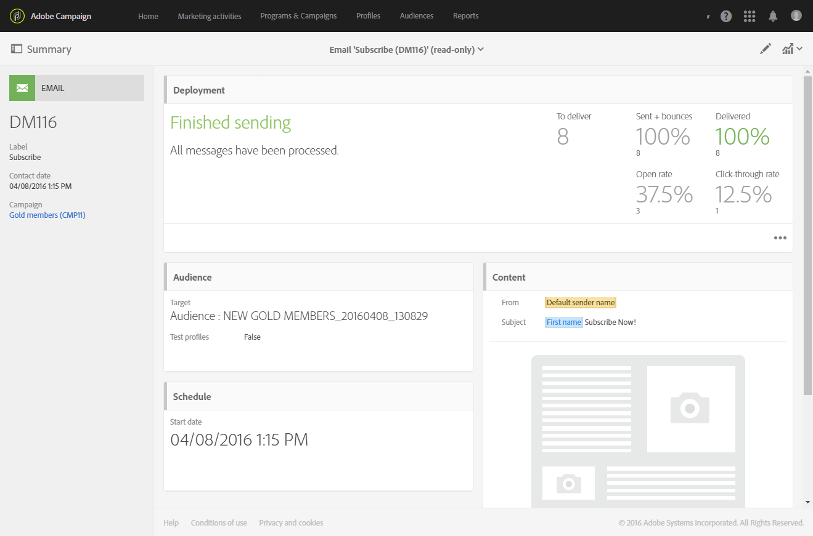

# 介面說明{#interface-description}

Adobe Campaign 可讓您導覽不同的功能表和畫面，以管理您的行銷活動。

所有 Adobe Campaign 畫面皆由下列元素組成：

* 導覽的頂端列
* 存取特定功能與設定的進階功能表
* 處理特定元素的中央區域
* 根據內容，在顯示的元素中篩選或搜尋的橫向面板。

## 首頁 {#home-page}

首頁由一組卡片組成，可以讓您快速存取主要的 Adobe Campaign 功能。您可以在 Campaign 首頁中看到的容量清單，且依照您的權限與組織所設定的選項而定。

* **[!UICONTROL Create an email]** 卡片會帶您前往電子郵件建立助理。此助理可以讓您選取電子郵件的類型、選取訊息收件者並定義您的內容。請參閱[建立電子郵件](../../channels/using/creating-an-email.md)區段。
* **[!UICONTROL Create an SMS]** 卡片會帶您前往簡訊建立助理。此助理可以讓您選取簡訊類型、選取訊息收件者並定義內容。請參閱[建立簡訊](../../channels/using/creating-an-sms-message.md)區段。
* 此 **[!UICONTROL Create a Direct mail]** 卡片會將您帶到直接郵件建立助理。請參閱[建立直接郵件](../../channels/using/creating-the-direct-mail.md)區段。
* 此 **[!UICONTROL Create a push notification]** 卡片會帶您前往通知建立助理。此助理可以讓您選取推播通知類型、選取訊息收件者並定義您的內容。請參閱[建立推播通知](../../channels/using/preparing-and-sending-a-push-notification.md)區段。
* **[!UICONTROL Create an In-App message]**&#x200B;卡會帶您前往「應用程式內建立助理」。 此助理可讓您選取您要建立的應用程式內訊息類型、定義其屬性、對象和內容。 請參閱[建立應用程式內訊息](../../channels/using/about-in-app-messaging.md)一節。
* 此 **[!UICONTROL Marketing activities]** 卡片會帶您進入所有活動、方案與行銷活動的完整清單，尤其是電子郵件、簡訊、工作流程和登錄頁面。然後，您可在此處依名稱、日期、狀態或活動類型進行搜尋並篩選元素。如需詳細資訊，請參閱[行銷活動清單](../../start/using/marketing-activities.md#about-marketing-activities)區段。
* 此 **[!UICONTROL Programs & campaigns]** 卡片會帶您進入可以建立與管理行銷活動的方案清單。請參閱[方案清單](../../start/using/programs-and-campaigns.md#about-plans--programs-and-campaigns)。
* 此 **[!UICONTROL Timeline]** 卡片會直接帶您進入行銷活動的互動式時間表，您可以在其中諮詢目前的方案及其內容。請參閱[時間表](../../start/using/timeline.md)。
* 此 **[!UICONTROL Customer profiles]** 卡片會直接將您導向至設定檔清單。在此，您可以諮詢與清單中每個設定檔有關的事件。請參閱[管理設定檔](../../audiences/using/about-profiles.md)。
* 此 **[!UICONTROL Audiences]** 卡片會直接將您帶至對象清單。從這裡，您可以存取現有的對象並建立新的對象。請參閱[管理對象](../../audiences/using/about-audiences.md)。

## 頂端列 {#top-bar}

每個螢幕上都會顯示頂端列，讓您瀏覽Adobe Campaign的功能，並存取連線的Adobe個人檔案、通知、Adobe Experience Cloud服務和解決方案，以及檔案。

導覽原則為：

* 該頁面左上角的 **[!UICONTROL Adobe Campaign]** 標誌可讓您存取進階功能與設定。功能表視您的設定檔與權限。

   進階功能表會顯示在[進階功能表](#advanced-menu)區段中。

* 此 **[!UICONTROL Home]** 連結允許您顯示 Adobe Campaign 首頁。
* 這些 **[!UICONTROL Marketing activities]**、**[!UICONTROL Programs & Campaigns]**、**[!UICONTROL Profiles]**、**[!UICONTROL Audiences]** 和 **[!UICONTROL Reports]** 連結可以讓您存取與這些功能連結的檢視。
* **解決方案切換器**&#x200B;圖示可讓您在組織之間切換或切換至不同的應用程式。
* **[!UICONTROL Help]**&#x200B;按鈕可讓您存取Adobe Campaign Standard檔案、視訊、發行說明和版本規劃，以及Adobe Experience Cloud社群和客戶服務的連結。
* 「組織」按鈕
* 此&#x200B;**通知**&#x200B;圖示會顯示最新警報或資訊。
* 此&#x200B;**使用者**&#x200B;圖示可讓您顯示連結至設定檔的資訊。它可以訪問&#x200B;**[!UICONTROL Sign out]**&#x200B;按鈕和&#x200B;**[!UICONTROL About]**&#x200B;螢幕。

### 說明 {#help}

* **[!UICONTROL Search]** 將Adobe Experience League帶入產品：搜尋結果包括檔案和說明文章、社群論壇的結果和更多視訊內容，讓您更輕鬆地存取更多內容，協助您充分運用應用程式。
* **[!UICONTROL Help]** 頁籤
   * 連結可讓您快速存取Adobe Campaign Standard檔案、視訊和發行說明。
   * **[!UICONTROL Learning]** 此連結可讓您存取Adobe Campaign內容庫。
   * **[!UICONTROL Community]** 此連結允許您訪問ACS專門討論的論壇。

* **[!UICONTROL Support]** 標籤可讓您開啟支援案例，並透過電話或Twitter與我們聯絡。

* **[!UICONTROL Feedback]**  讓您更輕鬆地報告問題或分享您的想法。

   

## 進階功能表 {#advanced-menu}

按一下每個畫面左上方的 **Adobe Campaign** 圖示，以顯示進階功能表。進階功能表可能會依您的合約與使用者權限而有所不同。

此功能表可讓您導覽至特定功能與設定。

### 行銷計畫 {#marketing-plans}

此 **[!UICONTROL Marketing plans]** 圖示可讓您存取以下功能：

* **[!UICONTROL Marketing activities]** - 如需詳細資訊，請參閱[行銷活動清單](../../start/using/marketing-activities.md#about-marketing-activities)區段。
* **[!UICONTROL Programs & Campaigns]** - 如需此項目詳細資訊，請參閱[方案清單](../../start/using/programs-and-campaigns.md#about-plans--programs-and-campaigns)區段。
* **[!UICONTROL Timeline]** - 如需詳細資訊，請參閱[時間表](../../start/using/timeline.md)區段。
* **[!UICONTROL Transactional messages]**，其中包含子功能表 **[!UICONTROL Deliveries]** 和 **[!UICONTROL Event configuration]** - 如需詳細資訊，請參閱[交易式訊息](../../channels/using/getting-started-with-transactional-msg.md)。

### 設定檔與對象 {#profiles-e-audiences}

此 **[!UICONTROL Profiles & audiences]** 圖示可以讓您存取以下功能：

* **[!UICONTROL Profiles]** - 如需此項目詳細資訊，請參閱[管理設定檔](../../audiences/using/about-profiles.md)區段。
* **[!UICONTROL Test profiles]** - 如需詳細資訊，請參閱[管理測試設定檔](../../audiences/using/managing-test-profiles.md)區段。
* **[!UICONTROL Audiences]** - 如需詳細資訊，請參閱[管理對象](../../audiences/using/about-audiences.md)區段。
* **[!UICONTROL Services]** - 如需詳細資訊，請參閱[建立服務](../../audiences/using/creating-a-service.md)區段。

### 資源 {#resources}

此 **[!UICONTROL Resources]** 圖示可以讓您存取以下功能：

* **[!UICONTROL Templates]**，其中包含每種類型範本的子功能表 - 如需詳細資訊，請參閱[管理範本](../../start/using/marketing-activity-templates.md)區段。
* **[!UICONTROL Content blocks]** - 如需詳細資訊，請參閱[新增內容區塊](../../designing/using/personalization.md#adding-a-content-block)區段。
* **[!UICONTROL Content templates & fragments]** - 如需詳細資訊，請參閱[內容範本](../../designing/using/using-reusable-content.md#content-templates)區段。

### 管理員 {#administration}

此 **[!UICONTROL Administration]** 圖示可以讓您存取進階功能，而這些功能僅能由功能管理員執行。如需詳細資訊，請參閱[管理員](../../administration/using/get-started-campaign-administration.md)區段。

## 中央區域 {#central-zone}

使用者介面的中央區域是動態區域，其中包含元素清單或卡片範本組合。這可讓您編輯現有元素並建立資源。

中央區域的內容和顯示格式可能有所不同：

* **清單**&#x200B;會顯示各種元素，例如，方案、行銷活動、設定檔等。這些元素可以在 **[!UICONTROL Card]** 或 **[!UICONTROL List]** 模式中檢視。使用變更模式按鈕，可將一個模式切換到另一個模式。每個元素都會顯示指標。

   

   計數器可讓您瞭解元素的數量。如果此數字超過 30，您必須按一下此計數器以取得總數。

* **控制面板**&#x200B;顯示連結至活動之所有參數的概述。此畫面包含互動式區域，允許您獨立分隔與設定不同的概念。

   

* 如果在建立元素時可能有數個活動內容，**選取畫面**&#x200B;可讓您選取要新增的元素類型（行銷活動、傳送）。此選取畫面也可供存取報告。

   

* 對於工作流程與查詢編輯器，使用浮動視窗的&#x200B;**工作區**，可供您設計物件。

   您可以從浮動視窗中拖放元素至工作區，以設定相關元素。

   

## 動作列 {#action-bar}

根據所顯示的畫面類型，頂部將顯示一個包含連結至畫面的動作列。

此列不僅包含搜尋和篩選等常見動作，還包含與畫面相關的動作：

* 有關與&#x200B;**工作區**&#x200B;類型畫面的動作，請參閱工作流程的[動作列](../../automating/using/workflow-interface.md#action-bar)區段。
* 如需與 **控制面板** 畫面相關的動作，請參閱[訊息控制面板](../../channels/using/message-dashboard.md)區段以取得詳細資訊。
* 有關與 **清單** 類型屏幕相關的動作，請參閱以下的[自訂清單](../../start/using/customizing-lists.md)區段。
