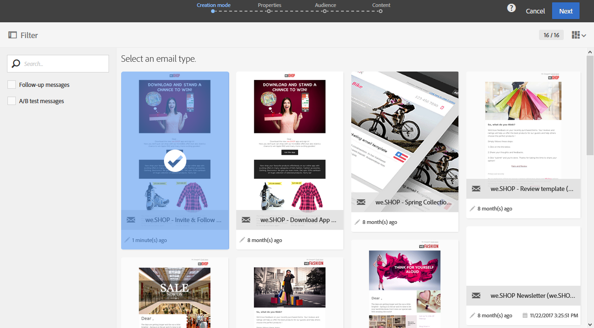

# 行銷活動範本 {#marketing-activity-templates}

## 關於範本 {#about-templates}

當您建立新的行銷活動時，精靈中的第一個畫面會要求您選取類型或範本。範本可讓您根據自己的需求，預先設定某些參數。範本可能包含行銷活動的完整或部分設定。範本管理是由功能管理員執行。

使用者擁有簡化的介面。建立新的行銷活動時，您只需要選取要使用的範本。無需擔心任何技術設定。範本中的功能管理員已經預先設定此項目。

例如，若是電子郵件範本，您可以預先填寫　HTML　內容、對象，以及傳送的任何其他參數：排程、測試設定檔、您傳送的一般屬性、進階參數等。這可讓您在建立新活動時節省時間。

對於每個行銷活動類型，只需要最少的設定，就可使用一或多個現成的範本。無法修改或刪除這些現成的範本。

範本適用於下列行銷活動：

* 方案
* Campaign
* 電子郵件傳送
* 簡訊傳送
* 推播通知
* 登錄頁面
* 工作流程
* 服務
* 匯入
* 交易式訊息

## 建立新範本 {#creating-a-new-template}

平台的功能管理員可在 **[!UICONTROL Resources > Templates]** 功能表下方管理訊息範本。無法修改或刪除現成的範本。若要建立新範本，您必須複製現有範本。

1. 選取現有範本。在我們的範例中，我們已選取 **[!UICONTROL Delivery template]**。

   

1. 讓滑鼠停留在滑鼠上，然後選取 **[!UICONTROL Duplicate element]** 選項。

   

1. 設定您需要的任何設定，就像從頭開始建立[新行銷活動](../../start/using/marketing-activities.md#creating-a-marketing-activity)時會做的事情一樣。

   

之後，在建立行銷活動時，標準使用者可在精靈的第一個畫面中選取建立的範本。

## 使用範本 {#using-a-template}

我們現在將探討如何使用在前一節中建立的範本。

>[!NOTE]
>
>一般而言，依據範本建立行銷活動燈是由標準使用者類型設定檔執行。

1. 建立新的行銷活動。

   

1. 在精靈的第一個畫面中，選取您要使用的範本。

   

   行銷活動會使用範本中定義的參數進行預先設定。

   
