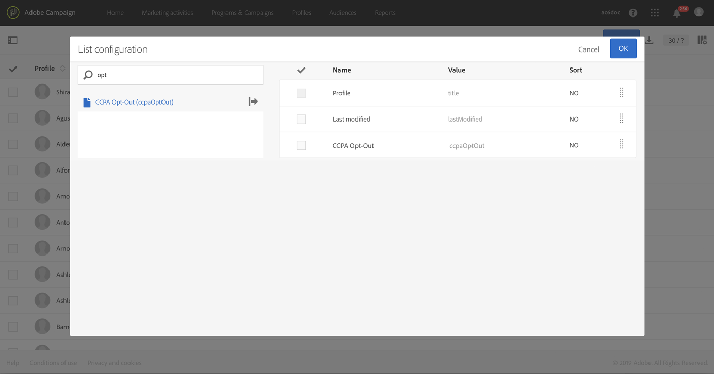

# 管理隱私權要求 {#privacy-requests}

有關隱私權管理的一般簡報，請參閱 [本節](../../start/using/privacy-management.md)。

此資訊適用於GDPR、CCPA、PDPA和LGPD。 For more on these regulations, see [this section](../../start/using/privacy-management.md#privacy-management-regulations).

CCPA專屬的個人資訊銷售選擇退出說明請見本 [節](#sale-of-personal-information-ccpa)。

>[!IMPORTANT]
>
>從19.4開始，已不再使用促銷活動API和介面來存取和刪除請求。 對於任何GDPR、CPA、PDPA或LGPD存取和刪除要求，您都需要使用隱私核心服 [務整合方法](#create-privacy-request) 。

## 關於隱私權要求 {#about-privacy-requests}

為協助您做好隱私權準備，Adobe Campaign可讓您處理存取和刪除要求。 本 **節將說明** 「存取權 **」和「忘記權** （刪除請求）」 [等](../../start/using/privacy-management.md#right-access-forgotten)。

若要執行這些要求，您必須使用隱私 **核心服務整合** 。 從「隱私權核心服務」推送至所有Experience Cloud解決方案的隱私權要求，由Campaign透過專用的工作流程自動處理。

### 必要條件 {#prerequesites}

Adobe Campaign提供資料掌控者工具，可針對儲存在Adobe Campaign中的資料建立和處理隱私權要求。 不過，資料掌控者有責任處理與資料主體（電子郵件、客戶服務或入口網站）的關係。

因此，您身為資料掌控者的責任是確認提出請求的資料主體的身分，並確認傳回給請求者的資料與資料主體有關。

>[!NOTE]
>
>如需有關個人資料以及管理資料的不同實體（資料控制者、資料處理者和資料主體）的詳細資訊，請參 [閱個人資料和人員](../../start/using/privacy.md#personal-data)。

### 名稱空間 {#namesspaces}

在建立隱私權要求之前，您必須先定義要使用的命名空間。 namespace是用來識別Adobe Campaign資料庫中資料主體的索引鍵。 現成可用的兩個名稱空間：電子郵件和行動電話。 如果您需要不同的命名空間（例如描述檔自訂欄位），請依照下列步驟進行。

另請參閱本教 [學課程](https://experienceleague.adobe.com/docs/campaign-standard-learn/tutorials/privacy/namespaces-for-privacy-requests.html?lang=en#privacy) ，瞭解如何建立命名空間。

>[!NOTE]
>
>如果您使用數個命名空間，您將需要為每個命名空間建立一個隱私權要求。

1. Click the Adobe Campaign logo in the top left corner, then select **[!UICONTROL Administration]** > **[!UICONTROL Namespaces]**.

   

1. 在名稱空間清單中，按一下 **[!UICONTROL Create]**。

   

1. 輸入 **[!UICONTROL Label]**。

   

1. 如果您想使用現有的身分服務命名空間，請從清 **[!UICONTROL Map from Identity Namespace Service]** 單中選擇並選取命名 **[!UICONTROL Identity Service Namespaces]** 空間。

   

   如果您想在Campaign中建立新的命名空 **[!UICONTROL Identity Service]** 間並加以對應，請選取 **[!UICONTROL Create new]** 並在欄位中輸入 **[!UICONTROL Identity namespace name]** 名稱。

   

   若要進一步瞭解身分名稱空間，請參閱 [Experience Platform檔案](https://experienceleague.adobe.com/docs/experience-platform/identity/namespaces.html?lang=en) 。

1. 一個Identity Service命名空間會對應至Campaign中的一個命名空間。 您需要指定在促銷活動中協調命名空間的方式。

   選擇目標映射(**[!UICONTROL Recipients]**、 **[!UICONTROL Real-time event]** 或 **[!UICONTROL Subscriptions to an application]**)。 如果您想使用數個目標映射，則需要為每個目標映射建立一個命名空間。

   

1. 選擇 **[!UICONTROL Reconciliation key]**。 此欄位將用於識別Adobe Campaign資料庫中的資料主體。

   

1. 按一下 **[!UICONTROL Create]**。您現在可以根據新的命名空間來建立隱私權要求。 如果您使用數個命名空間，您將需要為每個命名空間建立一個隱私權要求。

### Creating a Privacy request {#create-privacy-request}

>[!IMPORTANT]
>
>隱私 **核心服務整合** ，是您應用來處理所有存取和刪除要求的方法。
>
>從19.4開始，已不再使用促銷活動API和介面來存取和刪除請求。 對任何GDPR、CCPA、PDPA或LGPD存取和刪除要求使用核心隱私權服務。

「隱私權核心服務整合」可讓您透過單一JSON API呼叫，在多解決方案內容中自動化您的隱私權要求。 從「隱私權核心服務」推送至所有Experience Cloud解決方案的隱私權要求，由Campaign透過專用的工作流程自動處理。

請參閱 [Experience Platform Privacy Service](https://experienceleague.adobe.com/docs/experience-platform/privacy/home.html?lang=en) （體驗平台隱私服務）檔案，瞭解如何從隱私權核心服務建立隱私權要求。

每個隱私權核心服務工作會根據使用的名稱空間數目，在Campaign中分割為多個隱私權請求，一個請求對應一個名稱空間。 此外，一個作業可在多個例項上執行。 因此，會為一個作業建立多個檔案。 例如，如果請求有兩個名稱空間，且在三個例項上執行，則總共會傳送6個檔案。 每個命名空間和實例一個檔案。

檔案名的模式是： `<InstanceName>-<NamespaceId>-<ReconciliationKey>.xml`

* **InstanceName**:促銷活動例項名稱
* **NamespaceId**:使用之命名空間的Identity Service Namespace ID
* **協調密鑰**:編碼協調密鑰

### 資源清單 {#list-of-resources}

執行刪除或存取隱私權要求時，Adobe Campaign會根據所有具有描述檔資源連結（自有類型）的資源中的 **Ancorlibation** value來搜尋所有資料主體的資料。

以下是執行隱私權要求時會考量的現成可用資源清單：

* 設定檔（收件者）
* 描述檔傳送記錄檔(broadLogRcp)
* 描述檔追蹤記錄檔(trackingLogRcp)
* 傳送記錄檔（應用程式的訂閱）(broadLogAppSubRcp)
* 追蹤記錄檔（應用程式的訂閱）(trackingLogAppSubRcp)
* 應用程式的訂閱(appSubscriptionRcp)
* 描述檔的訂閱歷史記錄(subHistoRcp)
* 描述檔訂閱(subscriptionRcp)
* 訪客（訪客）

如果您建立的自訂資源具有描述檔資源（自有類型）的連結，也會考量這些資源。 例如，如果您有連結至配置檔案資源的事務處理資源和連結至事務處理資源的事務處理詳細資訊資源，則會同時考慮這些資源。

另請參閱本 [教學課程](https://experienceleague.adobe.com/docs/campaign-standard-learn/tutorials/privacy/custom-resources-for-privacy-requests.html?lang=en#privacy) ，瞭解如何修改自訂資源。

為了使此功能發揮作用，您需要在自訂資 **[!UICONTROL Deleting the target record implies deleting records referenced by the link]** 源中選取選項：

1. Click the Adobe Campaign logo in the top left corner, then select **[!UICONTROL Administration]** > **[!UICONTROL Development]** > **[!UICONTROL Custom resources]**.

1. 選擇具有指向配置式資源（自有類型）的連結的自定義資源。

1. 按一下 **[!UICONTROL Links]** 區段。

1. 針對每個連結，按一下鉛筆圖示(**[!UICONTROL Edit properties]**)。

1. In the **[!UICONTROL Behavior if deleted/duplicated]** section, select the **[!UICONTROL Deleting the target record implies deleting records referenced by the link]** option.

   

### 隱私權要求狀態 {#privacy-request-statuses}

隱私權要求的不同狀態如下：

* **[!UICONTROL New]** / **[!UICONTROL Retry pending]**:進行中時，工作流尚未處理請求。
* **[!UICONTROL Processing]** / **[!UICONTROL Retry in progress]**:工作流正在處理請求。
* **[!UICONTROL Delete pending]**:工作流程已識別所有要刪除的收件者資料。
* **[!UICONTROL Delete in progress]**:工作流正在處理刪除。
   <!--**[!UICONTROL Delete Confirmation Pending]** (Delete request in 2-steps process mode): the workflow has processed the Access request. Manual confirmation is requested to perform the deletion. The button is available for 15 days.-->
* **[!UICONTROL Complete]**:請求處理完成，無錯誤。
* **[!UICONTROL Error]**:工作流程遇到錯誤。 原因會顯示在欄的「隱私權要求」清 **[!UICONTROL Request status]** 單中。 例如，表 **[!UICONTROL Error data not found]** 示資料庫中找不到與資料主體相符 **[!UICONTROL Reconciliation value]** 的收件者資料。

### 禁用2步流程 {#disabling-two-step-process}

核心隱私權服務不支援2步驟程式。

>[!IMPORTANT]
>
>在使用核心隱私權服務整合來管理您的隱私權要求之前，您必須先停用從Campaign Standard介面刪除要求的2個步驟程式。

如果未禁用此選項，則所有使用隱私核心服務管理的刪除請求都將保持暫掛狀態，且將無法完成。

依預設，會啟動2步驟程式。

若要變更此模式，請 **[!UICONTROL Edit properties]**&#x200B;按一下畫面右上角的，然 **[!UICONTROL Privacy Requests]** 後取消勾選 **[!UICONTROL Activate the 2-step process]** 選項。

## 選擇退出個人資訊銷售 (CCPA) {#sale-of-personal-information-ccpa}

The **California Consumer Privacy Act** (CCPA) provides California residents new rights in regards to their personal information and imposes data protection responsibilities on certain entities whom conduct business in California.

GDPR和CCPA都常使用存取與刪除請求的設定與使用。 本節說明CCPA專屬的個人資料銷售選擇。

除了Adobe Campaign提供的 [「同意管理](../../start/using/privacy-management.md#consent-management) 」工具外，您還可以追蹤消費者是否選擇退出個人資訊銷售。

消費者透過您的系統決定，他／她不允許將個人資訊賣給第三方。 在Adobe Campaign中，您將可儲存及追蹤此資訊。

>[!NOTE]
>
>您可以透過促銷活動介面和API，利用退出選擇來銷售個人資訊。 您無法透過隱私權核心服務使用。

>[!IMPORTANT]
>
>您身為資料掌控者，有責任接收資料主體的要求並追蹤CCPA的要求日期。 身為技術供應商，我們只提供選擇退出的方式。 有關您擔任資料掌控者的詳細資訊，請參 [閱個人資料和角色](../../start/using/privacy.md#personal-data)。

### 自訂表格的先決條件 {#ccpa-prerequisite}

從19.4開始， **[!UICONTROL CCPA Opt-Out]** 「促銷活動」介面和API中會提供現成可用的欄位。 預設情況下，該欄位可用於標準資 **[!UICONTROL Profile]** 源。

如果您使用自訂描述檔資源，則需要擴充資源並新增欄位。 我們建議您使用與預設欄位不同的名稱，例如： **[!UICONTROL Opt-Out for CCPA]** (optouccpa)。 建立新欄位時，促銷活動API會自動支援該欄位。

如需如何擴充描述檔資源的詳細資訊，請參閱 [本節](../../developing/using/extending-the-profile-resource-with-a-new-field.md)。

>[!NOTE]
>
>修改資源是敏感操作，僅由專家用戶執行。

1. 前往 **[!UICONTROL Administration]** > **[!UICONTROL Development]** > **[!UICONTROL Custom Resources]**。 按一下自訂描述檔資源。 有關擴展資源的詳細資訊，請參 [閱本節](../../developing/using/creating-or-extending-the-resource.md)。

   

1. 按一 **[!UICONTROL Add field]** 下或 **[!UICONTROL Create Element]**，新增標籤、ID並選擇 **[!UICONTROL Boolean]** 類型。 對於名稱，請 **使用Opt-Out for CCPA**。 若為ID，請使用： **optOutCcpa**。

   

1. 在頁籤 **[!UICONTROL Screen definition]** 的下 **[!UICONTROL Detail screen configuration]**&#x200B;面，添加欄位並選擇 **[!UICONTROL Input field]**。 這將使配置檔案清單和詳細資訊中的欄位可用。  如需設定螢幕定義的詳細資訊，請參 [閱本節](../../developing/using/configuring-the-screen-definition.md)。

   

1. 前往 **[!UICONTROL Administration]** > **[!UICONTROL Development]** > **[!UICONTROL Publishing]**，準備出版物並發佈修改。 如需發佈資源的詳細資訊，請參 [閱本節](../../developing/using/updating-the-database-structure.md)。

   

1. 確認該欄位可用於描述檔的詳細資料。 如需詳細資訊，請參閱[本區段](#usage)。

### 使用狀況 {#usage}

資料掌控者有責任填入欄位的值，並遵循CCPA有關資料銷售的准則和規則。

若要填入值，可使用數種方法：

* 編輯收件者的詳細資料，以使用促銷活動的介面（請參閱下面）
* 使用促銷活動隱私權API(請參閱 [API檔案](../../api/using/managing-ccpa-opt-out.md))
* 透過資料匯入工作流程

然後，您應確保您絕不會向任何第三方銷售已選擇退出之個人資料。

1. 在促銷活動介面中，編輯描述檔以變更退出狀態。

   

1. 欄位值為時，資 **[!UICONTROL True]**&#x200B;訊會顯示在描述檔的詳細資料上。

   

1. 您可以設定描述檔清單以顯示輸出欄。 若要瞭解如何設定清單，請參 [閱本節](../../start/using/customizing-lists.md)。

   

1. 您可以按一下欄，根據退出資訊對收件者排序。

   
