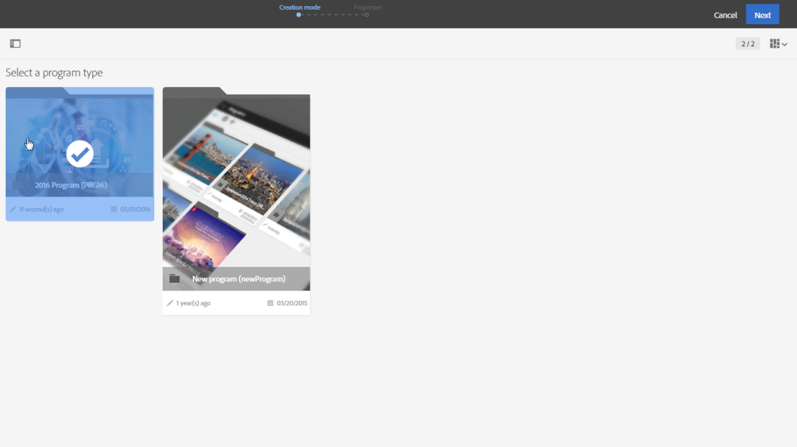

# Programs and campaigns{#programs-and-campaigns}

## About plans, programs and campaigns {#about-plans--programs-and-campaigns}

Adobe Campaign可讓您規劃行銷活動，以建立和管理不同類型的活動：電子郵件、SMS訊息、推播通知、工作流程、登陸頁面。這些促銷活動及其內容可以收集到計劃中。

程式和促銷活動可讓您重新整理並檢視連結到他們的不同行銷活動。

* **方案** 可能包含其他方案以及促銷活動、工作流程和登陸頁面。它會出現在時間軸中，並協助您組織行銷活動：您可以依國家/地區、品牌、單位等單位進行區隔。
* **促銷活動** 可讓您在單一實體下收集您選擇的所有行銷活動。促銷活動可能包含電子郵件、簡訊、推播通知、直接郵件、工作流程和登陸頁面。

為組織您的行銷計劃，Adobe建議您提供下列階層：方案&gt;子方案&gt;促銷活動&gt;工作流程&gt;交付。

方案和宣傳報告可讓您分析其影響力。例如，您可以在促銷活動層級建立報表，以匯總該促銷活動包含的所有傳送資料。

**相關主題：**

* [時間軸](../../start/using/timeline.md)
* [關於動態報表](../../reporting/using/about-dynamic-reports.md)

## Creating a program {#creating-a-program}

此計劃是第一個層級的組織。它可以包含子程式、促銷活動、工作流程或著陸頁面。

1. From the Adobe Campaign home page, select the **[!UICONTROL Programs & Campaigns]** card.
1. Click on the **[!UICONTROL Create]** button.
1. In the **[!UICONTROL Creation mode]** screen, select a program type.

   

   The program types available are based on templates defined in the **[!UICONTROL Resources]** &gt; **[!UICONTROL Templates]** &gt; **[!UICONTROL Program templates]** section. For more on this, refer to the [Managing templates](../../start/using/about-templates.md) section.

1. **[!UICONTROL Properties]** 在畫面中輸入程式的名稱和ID。

   

1. 選取程式的開始和結束日期。這些日期僅適用於程式本身。

   您可以在父程式內建立程式。若要這麼做，請從現有程式選取父程式。

1. Click on **[!UICONTROL Create]** to confirm the creation of the program.

程式會建立並顯示。Use the **[!UICONTROL Create]** button to add sub-programs, campaigns, workflows or landing pages.

>[!NOTE]
>
>您也可以從行銷活動清單中建立程式。

## Creating a campaign {#creating-a-campaign}

在程式和子程式中，您可以新增促銷活動。促銷活動可以包含行銷活動，例如電子郵件、簡訊、推播通知、工作流程和登陸頁面。

1. From the Adobe Campaign home page, select the **[!UICONTROL Programs & Campaigns]** card and access a program or sub-program.
1. Click on the **[!UICONTROL Create]** button and select **[!UICONTROL Campaign]**.
1. In the **[!UICONTROL Creation mode]** screen, select a campaign type.

   

   The campaign types available are based on templates defined in **[!UICONTROL Resources]** &gt; **[!UICONTROL Templates]** &gt; **[!UICONTROL Campaign templates]**. For more on this, refer to the [Managing templates](../../start/using/about-templates.md) section.

1. **[!UICONTROL Properties]** 在畫面中輸入促銷活動的名稱和ID。
1. 選取促銷活動的開始和結束日期。這些日期只適用於促銷活動本身。

   

1. Click on **[!UICONTROL Create]** to confirm the creation of the campaign.

建立並顯示促銷活動。Use the **[!UICONTROL Create]** button to add marketing activities to your campaign.

>[!NOTE]
>
>視您的授權合約而定，您只能存取其中部分活動。

您也可以從行銷活動清單建立促銷活動。您可以選擇透過促銷活動的屬性視窗將行銷活動連結至父程式或子程式。

## Programs and campaigns icons and statuses {#programs-and-campaigns-icons-and-statuses}

清單中的每個程式和清單中的每個促銷活動都有一個視覺化符號，圖示會指出執行狀態。此狀態取決於程式或促銷活動的有效期間。

* Gray: the program/campaign has not yet started - **[!UICONTROL Editing]** status.
* Blue: the program/campaign is in progress - **[!UICONTROL In progress]** status.
* Green: the program/campaign has finished - **[!UICONTROL Finished]** status. By default, the current date is automatically shown as the validity start date and the end date is calculated according to the start date (**D+186 days**). 您可以變更程式或促銷活動屬性中的日期。

