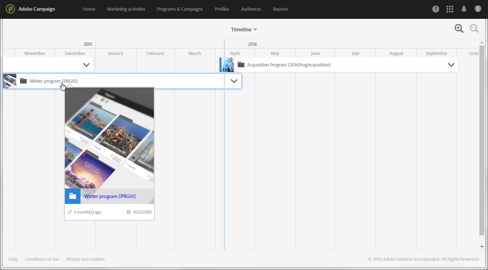

# Timeline{#timeline}

The **[!UICONTROL Timeline]** allows you to visualize programs that are in progress and their content.

若要存取時間軸，請從首頁按一下對應的卡片。

依預設，只有時間軸詳細資料方案會在定義的開始日期和結束日期之間以時間順序顯示。

每個程式均由包含對應縮圖和標籤的方塊表示。視螢幕大小和要顯示的元素數而定，標籤可能會被程式ID取代。

藍色垂直線是時間標記，可強調目前日期。預設會出現在畫面中央。您可以在畫面中向右或向左捲動以修改顯示的時段。

 這些按鈕可讓您增加或減少周長。 此按鈕也會提高較有限期間的詳細程度，直到顯示日期為止，  而且按鈕可讓您顯示較大的期間。

按一下每個方案名稱右邊的箭頭，以顯示對應的內容。程式可以包含子程式、促銷活動和著陸頁面。促銷活動的部署方式與程式相同，可包含電子郵件、簡訊和登陸頁面。

>[!NOTE]
>
>由於工作流程沒有日期的特殊概念，因此無法顯示在時間軸中。

當節目內容或促銷活動顯示時，對應的方塊會變成藍色，而右邊的箭頭則會向下翻轉。按一下箭頭以隱藏內容。

每個元素都有對應其類型的圖示：

*  ：Program
*  ：促銷活動
*  ：著陸頁面
*  ：電子郵件
*  ：SMS
*  ：推播通知

每個方塊左側邊框上的彩色線條表示相關元素的狀態。

* 元素尚未開始時，線條是灰色。
* 如果元素正在進行中，表示行為藍色。
* 元素一完成，線條就會變成綠色。

按一下程式或任何顯示的元素，即可顯示對應的卡片。然後按一下卡片，直接移至所選元素的內容，然後加以修改。

按一下畫面中的任何其他位置，讓卡片消失。
