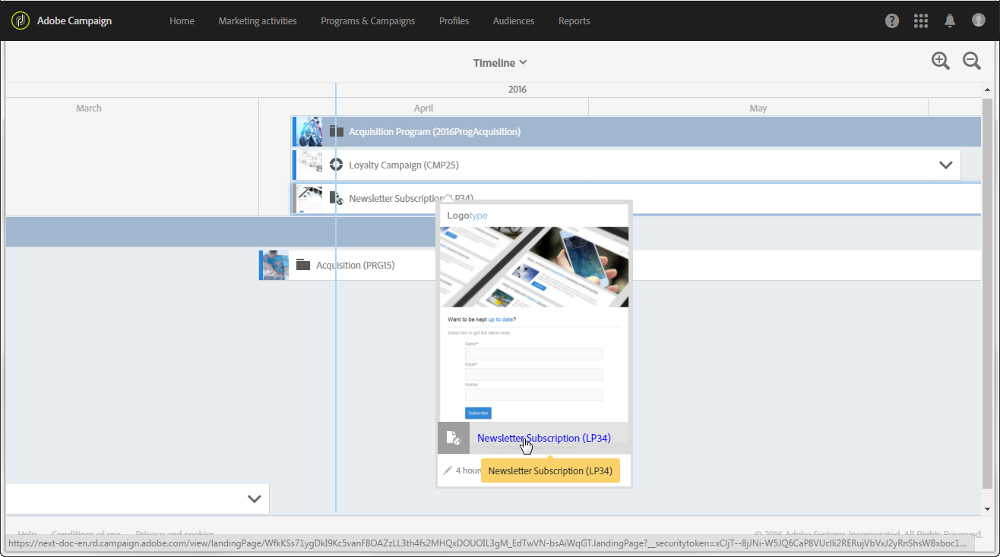

# 時間表{#timeline}

**[!UICONTROL Timeline]** 可讓您視覺化正在進行的進度及其內容。

若要存取時間軸，請按一下首頁中的對應卡片。

依預設，時間軸僅詳細列出在定義的開始日期和結束日期之間按時間順序顯示的程式。

每個程式由包含相應縮圖和標籤的方塊表示。根據畫面大小和要顯示的元素數目，標籤可能會由程式 ID 取代。

藍色垂直線是時間順序標籤，可反白顯示目前日期。依預設，它位於畫面中央。您可以在畫面中向右或向左捲動，以修改顯示的句點。

使用表徵圖；

*  減少周長，或在更有限的期間內增加細節層級，直到顯示天數為止
*  增加周長，或顯示更長的時間範圍

按一下每個程式名稱右側的箭頭，以顯示對應的內容。方案可包含子方案、行銷活動和登錄頁面。行銷活動的部署方式與程式相同，可包含電子郵件、簡訊和登錄頁面。

>[!NOTE]
>
>由於工作流程沒有日期的特定概念，因此不會顯示在時間軸中。

當顯示方案或行銷活動的內容時，相對應的方塊會變藍，而右側的箭頭會顛倒。重新按一下箭頭以隱藏內容。

每個元素都有與其類型對應的圖示：

*  方案
*  Campaign
*  著陸頁面
*  電子郵件
*  SMS
*  推播通知

每個方塊左邊方塊的彩色線會指出相關元素的狀態。

* 當元素尚未啟動時，行會顯示為灰色。
* 如果元素正在進行中，則行為為藍色。
* 元素一完成，線就會變成綠色。

按一下顯示的方案或任何其他元素，以顯示相對應的卡片。然後按一下卡片，直接移至選取之元素的內容並加以修改。

按一下畫面中的其他位置，讓卡片消失。
